# Capitulo 1

## Representação gráfica da evolução de acontecimentos no espaço-tempo

Neste capítulo vamos procurar familiarizar o leitor a gráficos que representam a evolução de acontecimentos no espaço (X) e no tempo (T). Os gráficos serão apresentados em duas dimensões, ou seja, no plano de uma folha de papel. Um acontecimento será definido como um “ponto” que corresponde a uma determinada posição (X) e a um determinado instante (T) em nosso universo espaço-tempo. Por exemplo, no instante em que dou partida em meu carro, este acontecimento corresponde a uma determinada posição X (onde estava meu carro quando dei a partida) e a um determinado instante T (a hora exata em que dei a partida).
Os três primeiros gráficos mostram como descrever acontecimentos em sistemas de coordenadas espaço-tempo (X, T), também chamados sistemas de referência ou simplesmente referenciais.
Os gráficos de 4 a 7 mostram como representar objetos e objetos em movimento nos referenciais X, T.

Os gráficos de 8 a 12 mostram como descrever o espaço-tempo usando dois referenciais diferentes, $X_1$,$T_1$ (azul) e $X_2$,$T_2$ (verde). Conforme o referencial escolhido, os acontecimentos se deslocam ou não, ou seja, as posições de cada acontecimento variam. No gráfico 10, por exemplo, um passageiro sentado dentro de um ônibus em movimento pode encontrar-se imóvel dentro do veículo. Entretanto, se considerarmos a cidade como referência, este passageiro se desloca junto com o ônibus. Depois de um certo tempo, o passageiro não se encontra no mesmo lugar, a depender do referencial (ônibus ou cidade), ou seja, ele continua sentado na mesma posição dentro do ônibus, mas deslocou-se na cidade. A hora, porém, é igual nos dois referenciais.
Os gráficos 13 e 14 mostram dois referenciais nos quais as posições permanecem iguais para cada acontecimento, mas os instantes (hora exata de cada acontecimento) não são os mesmos. No gráfico 14, um referencial utiliza o horário universal coordenado (UTC) e o outro referencial utiliza a hora local. Não se conserva mais a simultaneidade dos acontecimentos.
O gráfico 15 mostra como foi feita a definição de dois referenciais que, apesar de não conservarem a simultaneidade e a localização dos acontecimentos, conservam a mesma velocidade unitária.

Como veremos no capítulo 2, esta forma de definir os referenciais será útil para representar a velocidade da luz (c) e para permitir a visualização mais direta das transformações que ocorrem no espaço-tempo quando passamos de um referencial para outro.

Os gráficos 16 e 17 exemplificam o uso das relações trigonométricas para definir velocidades de um referencial em relação ao outro.

### Gráfico 1 •  Acontecimentos no espaço e no tempo

Um plano representa cada lugar (X) e cada instante (T) de um acontecimento

Os pontos $O$, $A$, $B$ e $C$ representam acontecimentos situados no espaço-tempo. A cada acontecimento corresponde um instante (situado no tempo $T$) e um lugar (situado no espaço $X$).

O acontecimento $O$ situa-se no instante $T$ = 0 (zero) e num lugar $X$ = 0 (zero) e é considerado muitas vezes como ponto de partida para localização de outros acontecimentos no espaço-tempo. Geralmente este acontecimento será chamado “origem” do sistema de coordenadas ou do referencial.

Os acontecimentos $B$ e $C$ são simultâneos, ou seja, ocorrem no mesmo instante ($T$ = 5). Eles ocorrem, porém, em lugares diferentes (a posição $X$ de $C$ = 6 e a posição $X $de $B$ = 15).

### Gráfico 2 • Representação do espaço-tempo com eixos não ortogonais

Os eixos de um sistema de coordenadas (ou referencial) nem sempre são perpendiculares entre si

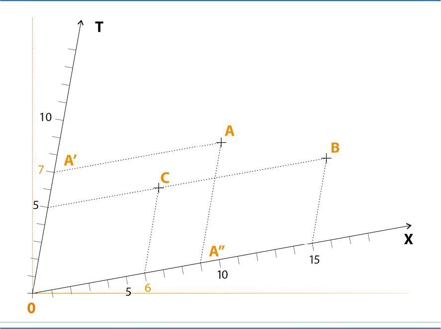

Para medir o tempo e a distância entre dois acontecimentos $O$ e $A$ em eixos não ortogonais, temos:
O acontecimento $O$ ocorre na origem, ou seja, instante 0 (zero) e distância 0 (zero). Para achar o tempo ($T$) do acontecimento $A$ será necessário traçar, a partir do ponto $A$, uma linha paralela ao eixo $X$ até encontrar o eixo do tempo $T$. Neste ponto de encontro $A’$, o tempo a que corresponde este acontecimento poderá ser medido ($T$ = 7). Este tempo representa a diferença entre o instante do acontecimento $O$ e o instante do acontecimento $A$.

Da mesma maneira, para localizar o acontecimento $A$ será necessário traçar, a partir do ponto $A$, uma linha paralela ao eixo $T$ até encontrar o eixo do espaço $X$. Neste ponto de encontro $A”$, a posição (localização) a que corresponde este acontecimento poderá ser medida ($X$ = 9). Esta posição representa a distância entre os acontecimentos $O$ e $A$.

Se as unidades para espaço e tempo deste gráfico forem metros e segundos, a distância entre os acontecimentos $O$ e $A$ será de 9 metros e o acontecimento $A$ ocorrerá 7 segundos após o acontecimento $O$.

### Gráfico 3 • Representação de acontecimentos em referenciais não ortogonais

Os dois gráficos representam os mesmos acontecimentos ($O$, $A$, $B$ e $C$) em referenciais diferentes e não ortogonais
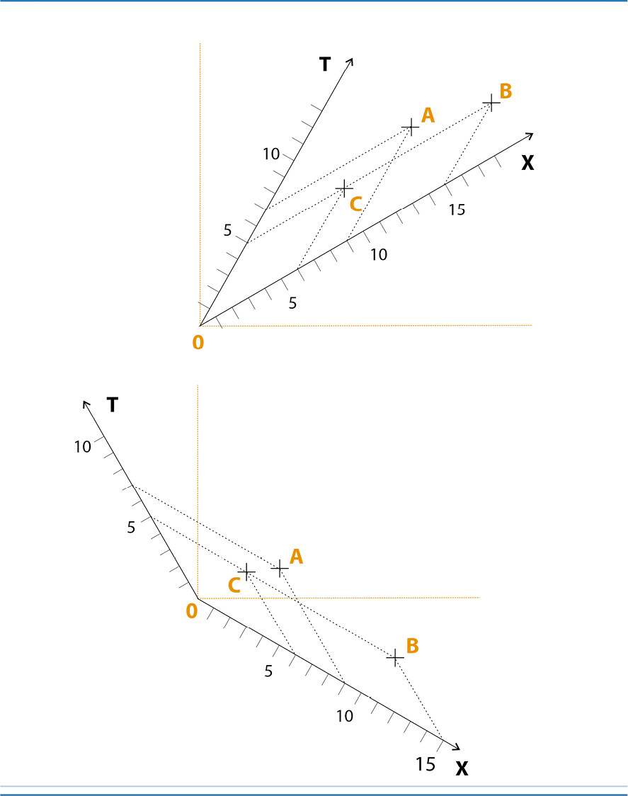

Referenciais não ortogonais serão muitas vezes utilizados para descrever acontecimentos em relatividade.

### Gráfico 4 • Representação de uma régua no espaço-tempo

Uma régua fixa de comprimento $AB$ igual a 8 metros é aqui representada em três instantes diferentes

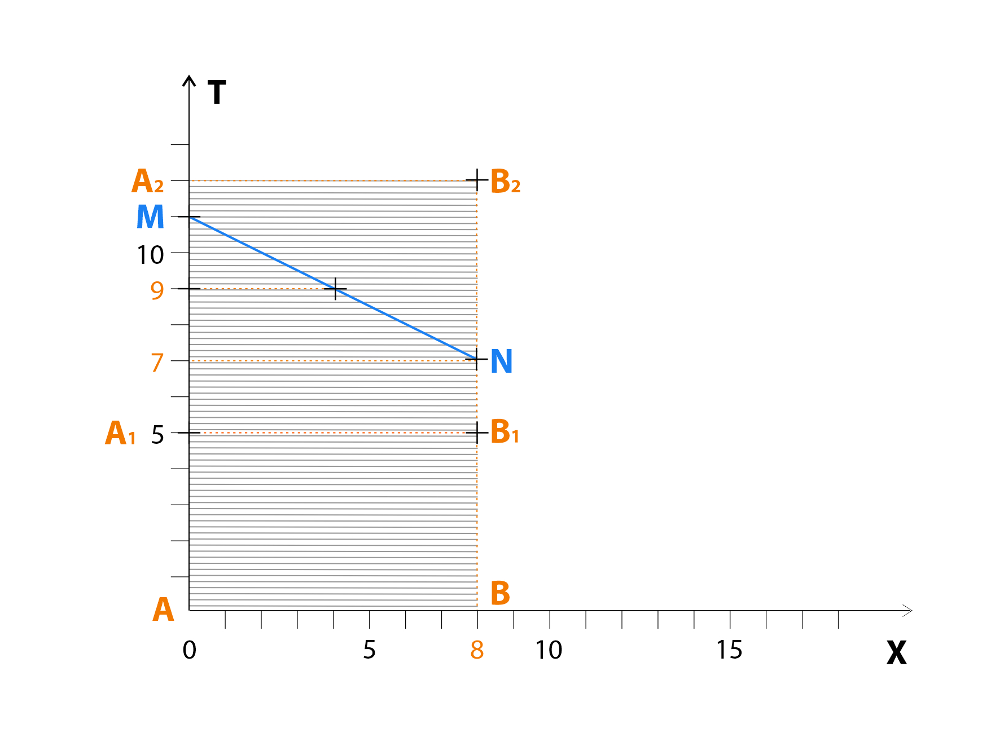

* $AB$ corresponde ao tempo $T = 0$
* $A$_1$B$_1 corresponde ao tempo $T = 5$
* $A$_2$B$_2 corresponde ao tempo $T = 12$
* A área hachurada representa todos os pontos desta régua durante um certo tempo (12 segundos).
* O segmento $MN$ representa a régua $AB$ vista parcialmente, em instantes diferentes:
* A extremidade $M$ está representada no tempo $T$ = 7
* A extremidade $N$ está representada no tempo $T$ = 11
* O ponto médio do segmento $MN$ está representado no tempo $T$ = 9

Para compreender melhor este gráfico, imagine que o segmento $MN$ representa um trem em movimento, cujos vagões são fotografados um a um. A foto do primeiro vagão é feita no instante $M$ = 7 segundos e a foto do último vagão no instante $N$ = 11 segundos.

Analisando as fotos das extremidades do trem, nota-se que elas estão defasadas em 4 segundos, sendo a foto do 1º vagão ($M$) mais velha do que a do último ($N$).

### Gráfico 5 • Representação de um objeto em movimento

Um objeto que se move sobre uma régua de 10 metros é representado neste gráfico

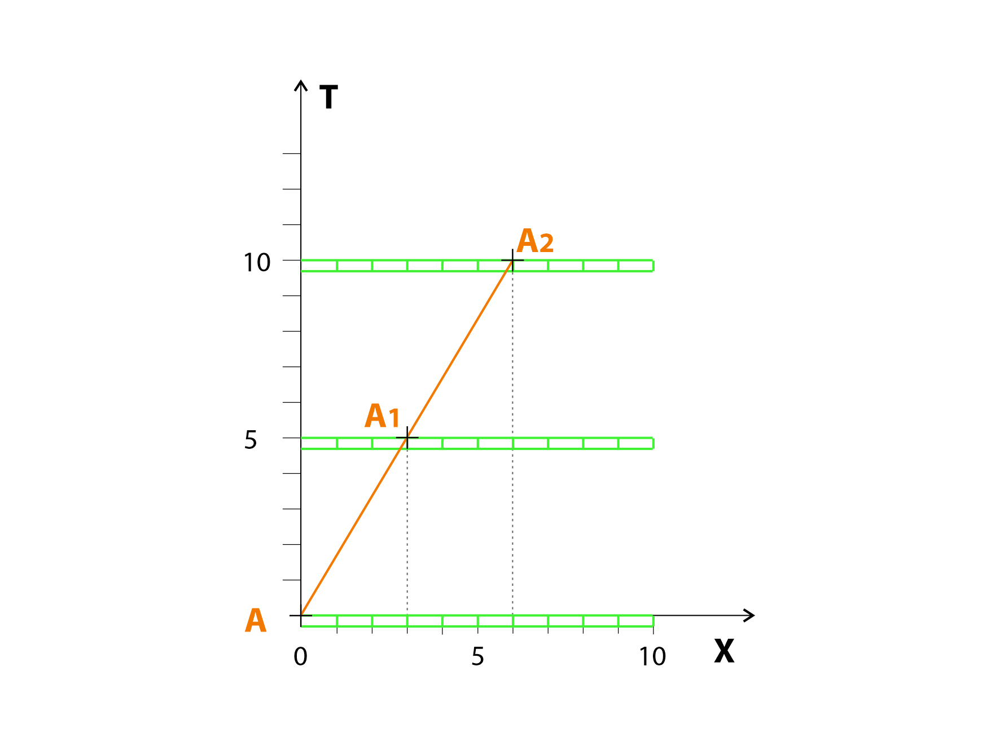

Uma régua fixa (verde), medindo 10 metros, é representada em três diferentes instantes: 0, 5 e 10 segundos. Um objeto $A$ se move sobre a régua. No início, o objeto percorreu 0 metros e é representado em $A$. Depois de 5 segundos, percorreu 3 metros e é representado em $A_1$. No final, após 10 segundos, percorreu 6 metros e é representado em $A_2$. O movimento deste objeto está representado por uma linha ($AA_2$) dentro de um referencial espaço-tempo ($X$, $T$).

### Gráfico 6 • Representação da trajetória de um objeto que se move no espaço-tempo

Representação da trajetória de um objeto que se move a uma velocidade média de 1,11 metros por segundo

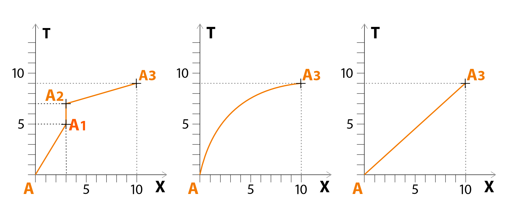

No primeiro gráfico, o objeto, representado pelo ponto $A$, desloca-se inicialmente 3 metros em 5 segundos; a seguir, fica imóvel durante 2 segundos e avança novamente 7 metros em 2 segundos (velocidade média = 10/9 = 1,11 m/s).

No segundo gráfico, o objeto representado pelo ponto $A$ move-se cada vez mais rápido durante 9 segundos para alcançar 10 metros (velocidade média = 10/9 = 1, 11 m/s).

No terceiro gráfico, o objeto representado pelo ponto $A$ move-se numa velocidade constante. Em 9 segundos ele percorre 10 metros (velocidade média = 10/9 = 1,11 m/s).

### Gráfico 7 • Representação da trajetória de um objeto que se desloca sobre uma régua móvel

Um objeto se desloca sobre uma régua que, por sua vez, também se move

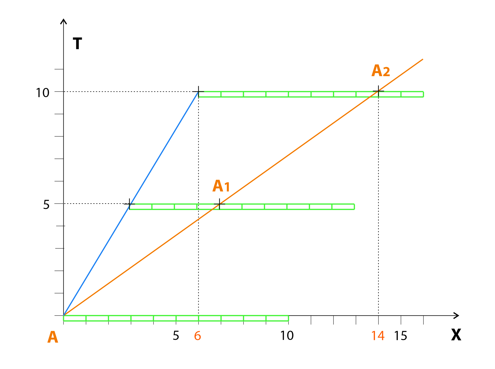

Uma régua de 10 metros se desloca no referencial $X$, $T$ numa velocidade de 6m/10s (0,6m/s). Sobre esta régua, um objeto, representado pelo ponto $A$, percorre 8 metros em 10 segundos ($A\to A_1\to A_2$). A velocidade de $A$ sobre a régua é de 8m/10s (0,8m/s).

A velocidade total de $A$, considerando o referencial $X$, $T$, será a adição simples das velocidades da régua e do objeto, ou seja, 6m/10s + 8m/10s = 14m/10s (1,4m/s).

Exemplo de uma adição simples de velocidades: Maria e João andam lado a lado na mesma velocidade constante, que se mantém durante todo o trajeto. Em determinado momento, Maria passa a andar numa esteira rolante que também se move em velocidade constante. João permanece andando ao lado, fora da esteira. Maria vai chegar antes de João, ou seja, as velocidades de Maria e da esteira serão somadas no trecho em que ela esteve na esteira.

### Gráfico 8 • Representação de um objeto fixo num referencial

O objeto $A$ fica imóvel no referencial $X_1$, $T_1$ (azul) durante 10 segundos.

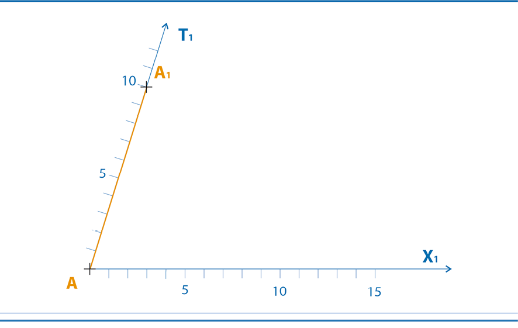

### Gráfico 9 • Representação da trajetória de um objeto num referencial

O objeto $A$ desloca-se 6 metros em 10 segundos no referencial $X_2$, $T_2$(verde).

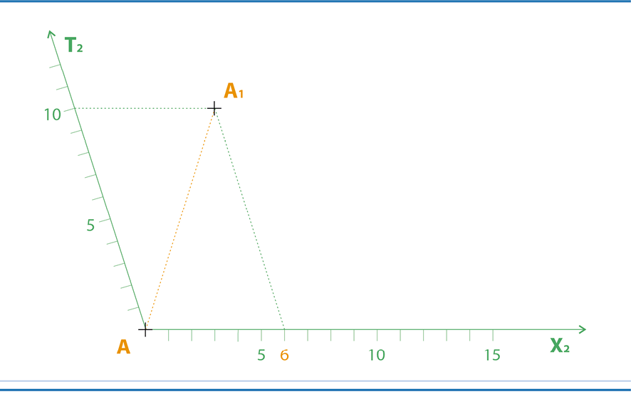

### Gráfico 10 • Representação da trajetória de um objeto em dois referenciais diferentes

Um objeto está fixo num referencial que se desloca em relação a outro

O deslocamento do objeto $A$ está representado em dois referenciais diferentes. No referencial $X_1$, $T_1$ (azul) o objeto $A$ fica imóvel durante 10 segundos. No referencial $X_2$, $T_2$ (verde) o objeto $A$ desloca-se 6 metros em 10 segundos.

Por convenção, vamos estabelecer que o referencial verde é fixo. Assim, podemos dizer que o referencial azul se desloca em relação ao (verde) numa velocidade de 6 m/10 s (0,6m/s).

Os eixos de espaço ($X_1$ e $X_2$) sobrepõem-se, mas as medidas de tempo são iguais nos dois referencias (a simultaneidade dos acontecimentos é conservada). De fato, quando o objeto $A$ se encontra em $A_1$, o tempo medido nos dois referenciais é o mesmo ($T_1$ = $T_2$ = 10).

### Gráfico 11 • Representação da trajetória de uma régua em dois referenciais diferentes

Uma régua está fixa num referencial que se desloca em relação a outro

Uma régua $AB$ está representada em dois referenciais diferentes.

No referencial $X_1$, $T_1$ (azul) a régua fica imóvel durante 10 segundos.
No referencial $X_2$, $T_2$(verde) a régua $AB$ desloca-se 6 metros em 10 segundos.

Se convencionarmos que o referencial verde é fixo, podemos dizer que o referencial azul se desloca em relação ao referencial verde numa velocidade de 6m/10s (0,6m/s).
Cada ponto da área $\mathbf{ABB_1A_1}$ representa um acontecimento que corresponde a um lugar específico da régua (entre 0 e 4 metros) e a um determinado tempo (entre 0 e 10 segundos).

### Gráfico 12 • Princípio de adição das velocidades
Um objeto move-se em relação a um referencial que se desloca em relação a outro 

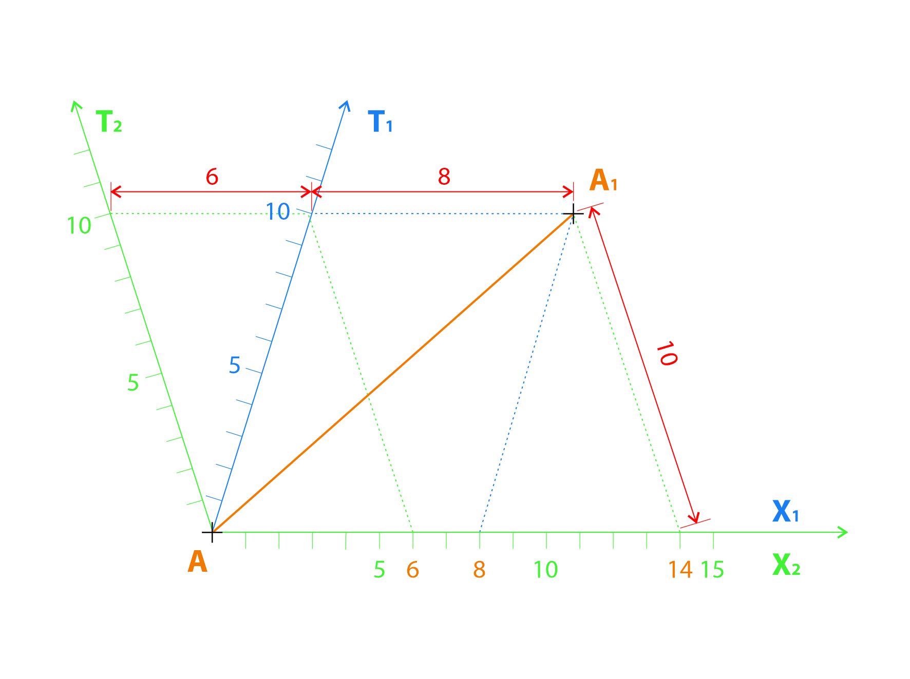

O deslocamento do objeto $A$ está representado em dois referenciais diferentes. No referencial $X_1$, $T_1$ (azul) o objeto $A$ desloca-se 8 metros em 10 segundos.
Se convencionarmos que o referencial $X_2$, $T_2$ (verde) é fixo, podemos dizer que o referencial azul se desloca em relação a ele numa velocidade de 6m/10s (0,6m/s).
No referencial verde o objeto $A$ desloca-se numa velocidade de 8m/10s + 6m/10s = 14m/10s (1,4m/s).
É importante observar que os eixos de espaço ($X_1$ e $X_2$) sobrepõem-se, mas as medidas de tempo são iguais nos dois referencias (a simultaneidade dos acontecimentos é conservada). De fato, quando o objeto $A$ se encontra em $A_1$, o tempo medido nos dois referenciais é o mesmo ($T_1$ = $T_2$ = 10)

### Gráfico 13 • Representação de dois referenciais que não conservam a simultaneidade

Dois acontecimentos podem ser simultâneos em relação a um referencial e não em relação a outro 

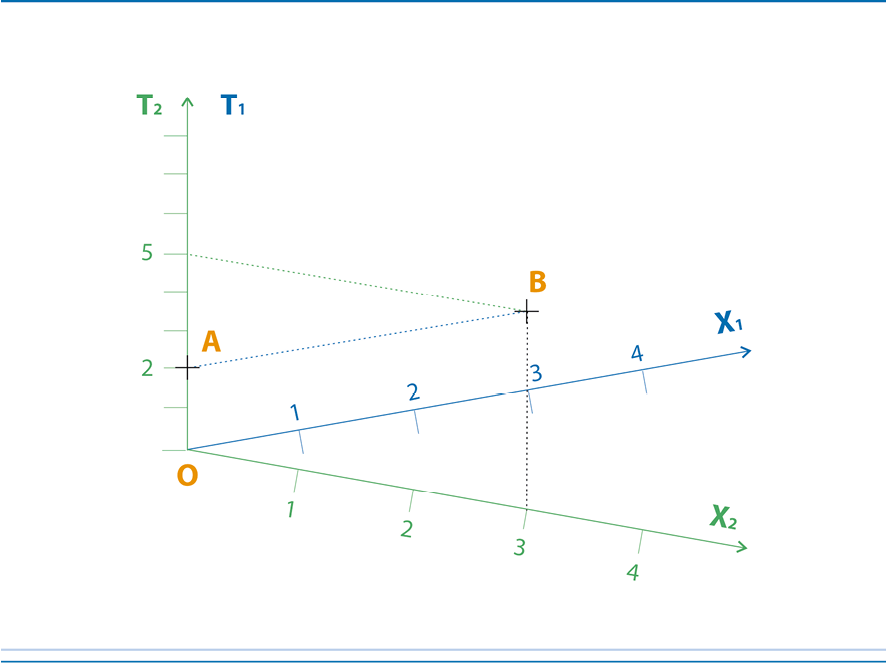

Os acontecimentos $A$ e $B$ são simultâneos no referencial $X_1$, $T$ (azul) e correspondem ao tempo $T$ = 2.
No referencial $X_2$, $T_2$ (verde) estes dois acontecimentos não são mais simultâneos e correspondem a instantes diferentes ($T_2A$ = 2 e $T_2B$ = 5 (diferença de 3 segundos).
Entretanto, as distâncias entre os dois acontecimentos são as mesmas nos dois referenciais (3 metros).

### Gráfico 14 • Exemplo de dois referenciais que não conservam a simultaneidade

Dois acontecimentos podem ser simultâneos em relação a um referencial e não em relação a outro

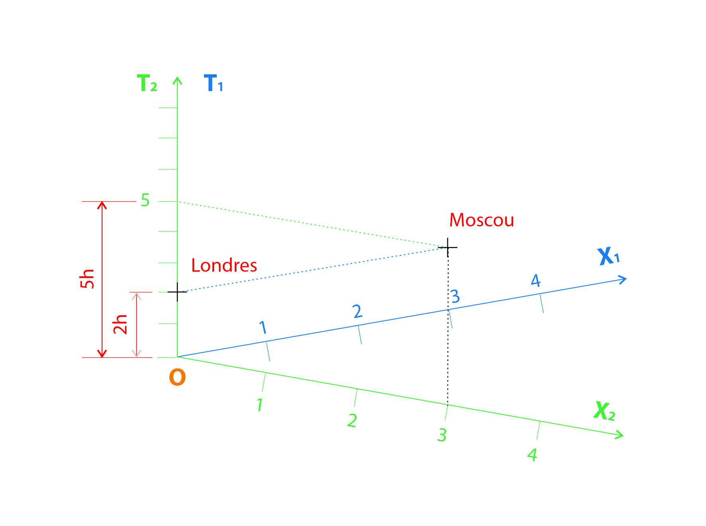

O eixo $T_1$ do referencial azul ($X_1$, $T_1$) representa o horário universal coordenado (UTC) que coincide com a hora local de Londres e que é usado para padronizar fusos horários no mundo todo (Londres UTC+0, Moscou UTC+3).
O eixo $T_2$ do referencial verde ($X_2$, $T_2$) representa a hora local nas cidades de Londres e Moscou.
Como exemplo, vamos imaginar duas irmãs que vivem em cidades diferentes, uma em Londres, outra em Moscou. Elas se telefonam todos os dias às 2pm (14 horas), horário universal.
A chamada telefônica é simultânea no referencial azul.
No referencial verde, entretanto, o telefonema ocorre às 2pm (14 horas) de Londres e às 5pm (17 horas) de Moscou.

### Gráfico 15 • Representação de dois referenciais que conservam a mesma velocidade unitária

Podemos definir referenciais de maneira que a velocidade unitária seja a mesma em relação a eles.
Para tal, o ângulo formado pelos eixos $T_2$ e $T_1$ deve ser igual ao ângulo formado pelos eixos $X_1$ e $X_2$.

Dois referenciais $X_1$, $T_1$ (azul) e $X_2$, $T_2$ (verde) não conservam a simultaneidade dos acontecimentos, tampouco conservam a posição no espaço. No entanto, para o objeto $A$ que se move em direção a $B$, a velocidade medida em cada referencial será a mesma, ou seja (5,68/5,68 = 1 no referencial verde e 4/4 = 1 no referencial azul).
Nota-se que, intencionalmente, manteve-se um ângulo de 90 graus entre os eixos $T_1$ e $X_2$ e entre os eixos $T_2$ e $X_1$ o que vai facilitar a aplicação das razões trigonométricas (seno, cosseno e tangente) para relacionar os ângulos com os comprimentos dos lados do triângulo retângulo.
Em outras palavras, a ortogonalidade dos eixos permite a visualização direta dos triângulos retângulos no plano, tornando a relação entre ângulos e lados mais intuitiva.

### Gráfico 16 • Representação de um referencial fixo em relação a um referencial móvel

Dois referenciais (um fixo e um móvel) que conservam a velocidade unitária, não medem o espaço e o tempo da mesma maneira

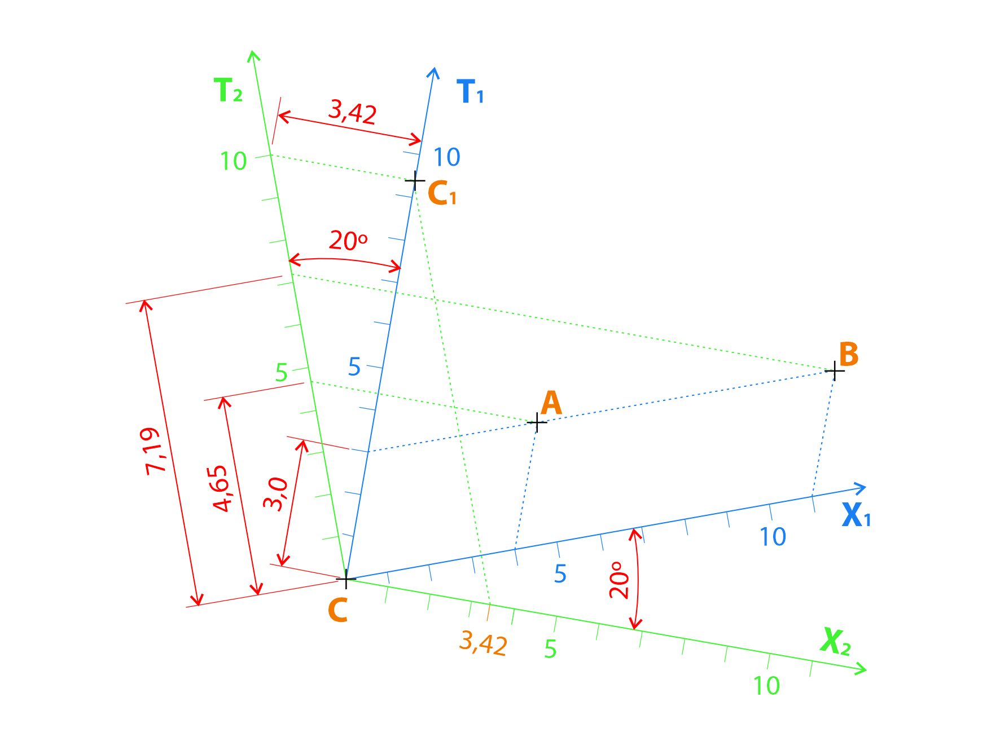

Em relação ao espaço, o referencial $X_1$, $T_1$ (azul) desloca-se em relação ao referencial $X_2$, $T_2$ (verde). De fato, o objeto $C$ fica imóvel no referencial azul e desloca-se 3,42 metros para direita em 10 segundos no referencial verde.
A velocidade do referencial azul em relação ao referencial verde pode ser calculada como sendo o seno do ângulo formado pelos eixos $T_1$ e $T_2$ que, neste gráfico, mede 20 graus ($V$ = sen 20°=0,342).
Em relação ao tempo, os acontecimentos $A$ e $B$ são simultâneos no referencial azul $T_1$($A$) = $T_1$($B$) = 3, mas, correspondem a instantes diferentes $T_2$($A$) = 4,65 e $T_2$($B$) = 7,19 no referencial verde. ângulos medem 20 graus o que corresponde a uma velocidade $V$ = sen 20°=0,342.

### Gráfico 17 • Representação de uma régua em relação a dois referenciais

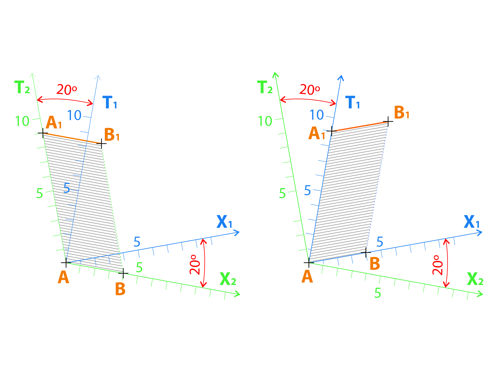

O referencial $X_1$, $T_1$ (azul) desloca-se numa velocidade de 0,342 (seno de 20 graus) em relação ao referencial $X_2$, $T_2$ (verde).
Uma régua $AB$ é representada em ambos os gráficos. No gráfico da esquerda a régua fica imóvel no referencial verde. No gráfico da direita ela fica imóvel no referencial azul.

Nos dois gráficos a régua encontra-se em $AB$ no instante $T$ = 0 e em $A_1B_1$ no instante $T$ = 9. A régua ocupa, sucessivamente, todos os pontos da área $ABB_1A_1$.