import ChapterNavigation from '../components/ChapterNavigation.astro';

# Capitulo 2

## Representação gráfica das transformações do espaço e do tempo na relatividade restrita

A descoberta fundamental que deu origem à teoria da relatividade restrita foi a constatação de que as medidas da velocidade da luz ($c$) apresentam sempre os mesmos resultados. Assim, quando examinamos um fenômeno a partir de um observatório ou referencial situado no planeta Terra ou localizado dentro de um foguete que, em relação à Terra, desloca-se a grande velocidade, teremos sempre os mesmos resultados em relação às medidas da velocidade da luz.
Partindo da premissa de que as medidas da velocidade da luz resultam sempre as mesmas, nós só poderemos passar de um referencial a outro se, a partir de cada referencial considerado, as medidas da velocidade da luz não se modificarem. Esse assunto foi introduzido no primeiro capítulo, quando falamos de um sistema formado por dois referenciais que conservam a velocidade unitária1 (Gráfico I-15).
No decorrer do capítulo II, vamos estudar transformações muito estranhas pois conservam a velocidade da luz, mas não conservam a simultaneidade. Essas transformações nos sugerem, por exemplo, que dentro de um foguete movimentando-se com velocidades próximas à velocidade da luz, alguns comprimentos parecem, para um observador situado em outro referencial, mais curtos ou mais longos.
As transformações nos mostram, também, que relógios posicionados ao longo do foguete parecem avançar de forma mais lenta ou mais rápida do que relógios do observador. Seria como se olhássemos para uma serpente cuja cabeça e cauda apresentam idades diferentes.
Muitas experiências em física confirmam esses resultados surpreendentes. Entretanto, não se deve presumir que certas dimensões realmente variam. A impressão de contração ou dilatação do espaço e do tempo seria apenas um efeito do método utilizado para as medições.
Podemos fazer uma analogia com o momento em que se descobriu que a Terra era redonda. Isto não significava que as pessoas deveriam estar de cabeça para baixo do outro lado do planeta. Se fizermos uma pergunta: “É verdade que do outro lado da Terra as pessoas estão de cabeça para baixo?” será difícil respondê-la com um simples “sim” ou “não”. Da mesma forma, se fizermos a pergunta: “É verdade que um foguete, movimentando-se a grande velocidade é mais curto do que quando está imóvel?” Também será difícil respondê-la de forma simples.
Vamos procurar discutir essas questões no decorrer do capítulo por meio de gráficos que mostram como é possível observar e medir distâncias e tempos em referenciais que movem-se uns em relação aos outros a grandes velocidades.
### Gráfico II-1 •  Referenciais que conservam a velocidade da luz

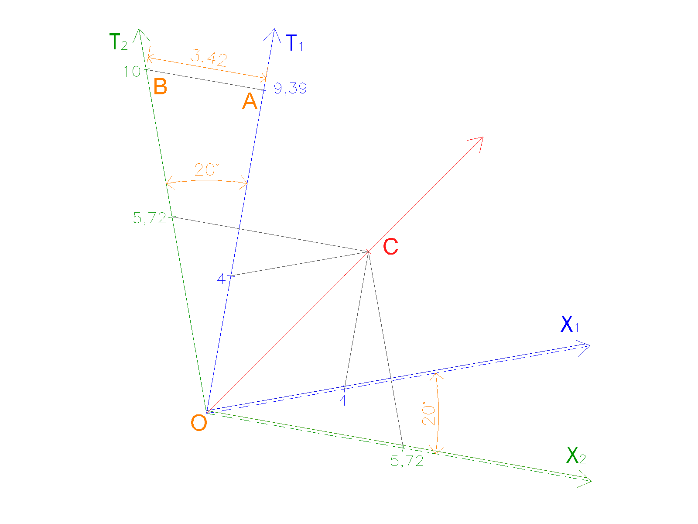

Este gráfico, já introduzido no capítulo anterior (Gráfico I-15), mostra como representar dois referenciais que conservam a velocidade da luz. 
O referencial azul $X_1$,$T_1$ é móvel e desloca-se em relação ao referencial verde $X_2$,$T_2$ (fixo) numa velocidade de 0,342c, que corresponde, conforme já vimos no Gráfico I-16, ao seno do ângulo formado pelas coordenadas $T_1$ e $T_2$ (o ângulo mede 20°, então, $V$=sen20°=0,342c).
De fato, um objeto $O$, fixo no referencial azul, estará em $A$ após 10 segundos de $T_2$, ou seja, o objeto desloca-se 3,42 metros em 10 segundos ($V$=0,342m/s) em relação ao referencial verde (distância representada pela linha $BA$, $T_2$ = 10s).
A linha $OC$ representa a velocidade da luz. Qualquer objeto que desloca-se de $O$ a $C$ tem a mesma velocidade unitária ($c$=1) nos dois referenciais.

Gráficos semelhantes a este serão utilizados neste capítulo, para possibilitar a visualização de transformações no espaço-tempo.

### Gráfico II-2 •  Representação de uma régua fixa em dois referenciais

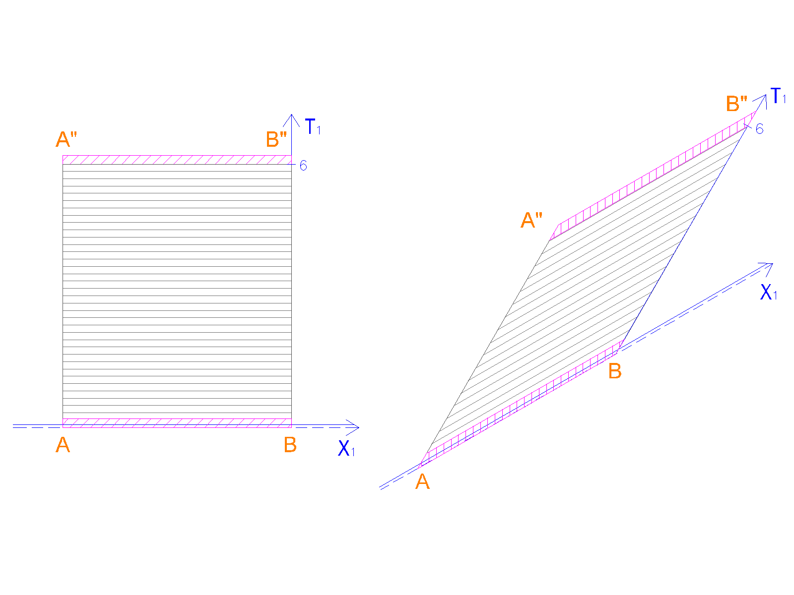

A régua $AB$ está fixa no referencial $X_1$,$T_1$ durante 6 segundos. A régua apenas envelhece, ou seja, passa por todos os pontos da área $ABB^{''}A^{''}$, indo de $AB$ até $A^{''}B^{''}$.
Os gráficos mostram a mesma régua em referenciais diferentes, um ortogonal e o outro não.

### Gráfico II-3 •  Representação de uma régua fixa em um referencial não ortogonal

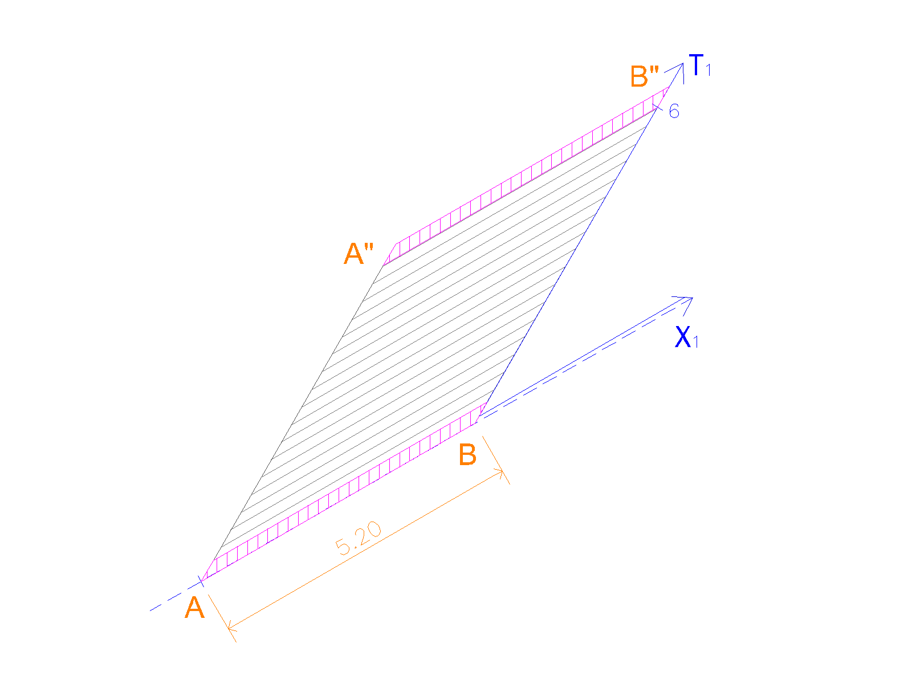

No referencial $X_1$,$T_1$ a régua está fixa e mede 5,20 metros. No instante $T_1$=0 a régua está representada em $AB$ e no instante $T_1$=6 está representada em $A^{''}B^{''}$.

### Gráfico II-4 •  Representação de uma régua móvel em relação a um referencial fixo

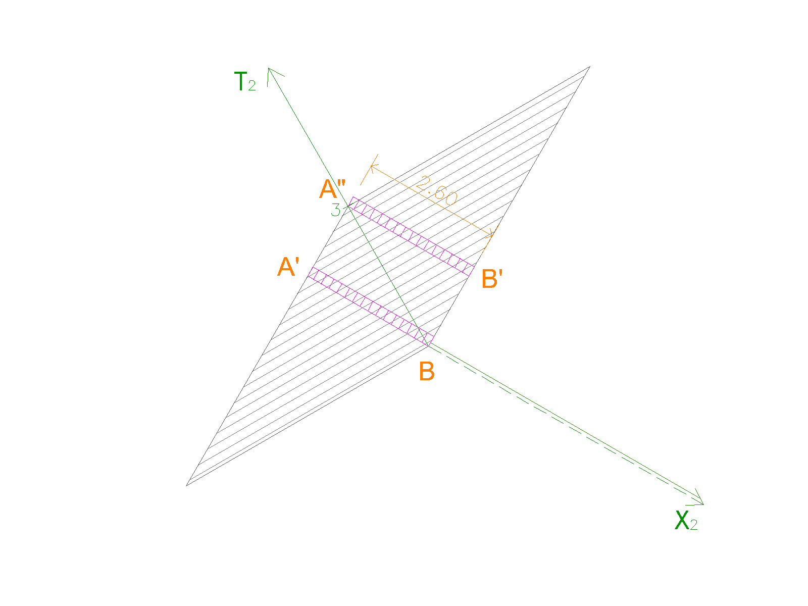

A mesma régua que aparece no Gráfico II-3 está representada no referencial $X_2$,$T_2$ (verde, fixo).
No instante $T_2$=0, a régua é vista como $A^{'}B$ e no instante $T_2$=3, a régua é vista como $A^{''}B^{'}$.

### Gráfico II-5 •  Representação de uma régua que move-se a uma velocidade de 0,866c2

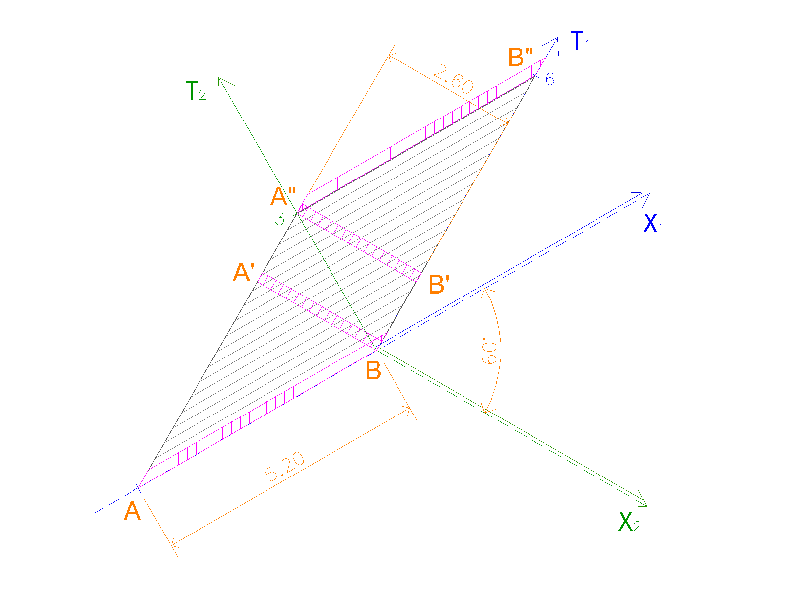

A mesma régua $AB$ do Gráfico II-3, aqui aparece fixa no referencial $X_1$,$T_1$ (azul). O referencial azul desloca-se em relação ao referencial fixo $X_2$,$T_2$ (verde).
Conforme já vimos em gráficos anteriores, a velocidade do referencial azul em relação ao referencial verde pode ser calculada como sendo o seno do ângulo de 60°, formado pelos eixos $T_1$ e $T_2$, correspondendo a uma velocidade $V$=0,866c.
No referencial azul a régua mede 5,20 metros e é representada em $AB$ no instante $T_1$=0 e em $A^{''}B^{''}$ no instante $T_1$=6.
A régua no referencial verde, representada em $A^{'}B$ no instante $T_2$=0 e em $A^{''}B^{'}$ no instante $T_2$=3, tem a metade do comprimento original da régua $AB$, ou seja, ela mede 2,60 metros.
### Gráfico II-6 •  Representação de uma régua em diferentes instantes num referencial

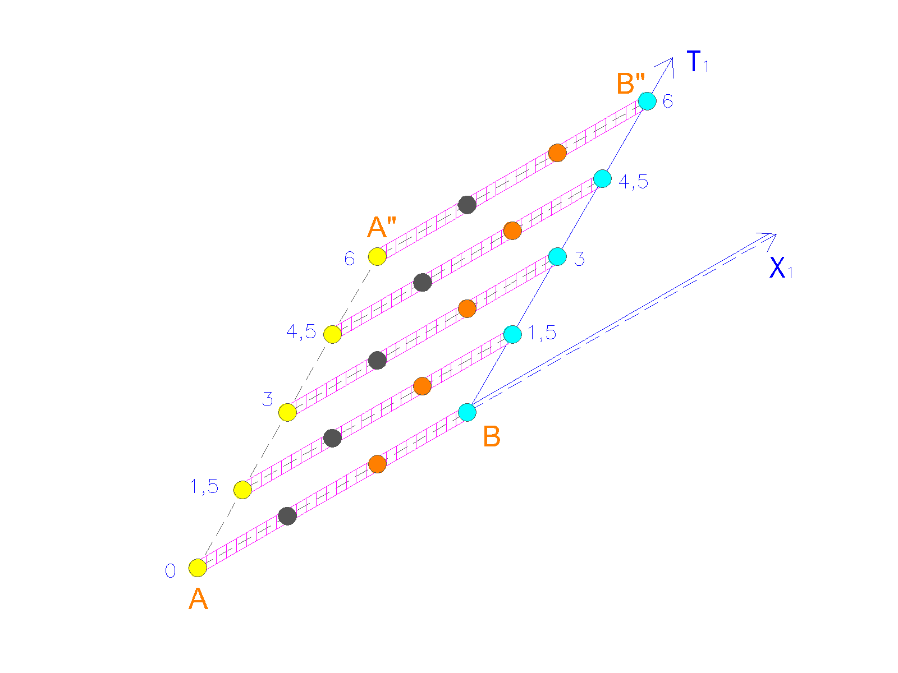

Uma régua fixa no referencial $X_1$,$T_1$ (azul) é representada por $AB$ no tempo $T_1$=0 e por $A^{''}B^{''}$ no tempo $T_1$=6.
As réguas paralelas a $AB$ representam diferentes instantes de envelhecimento:
$T_1$=1,5 segundos.
$T_1$=3,0 segundos.
$T_1$=4,5 segundos.
$T_1$=6,0 segundos.
Os relógios coloridos, desenhados ao longo de cada régua, estão sincronizados em relação ao referencial azul, ou seja, todos marcam o mesmo horário. No tempo $T_1$=3, por exemplo, todos os relógios coloridos marcam 3 segundos.

### Gráfico II-7 •  Representação de relógios num referencial fixo e num referencial móvel (1)

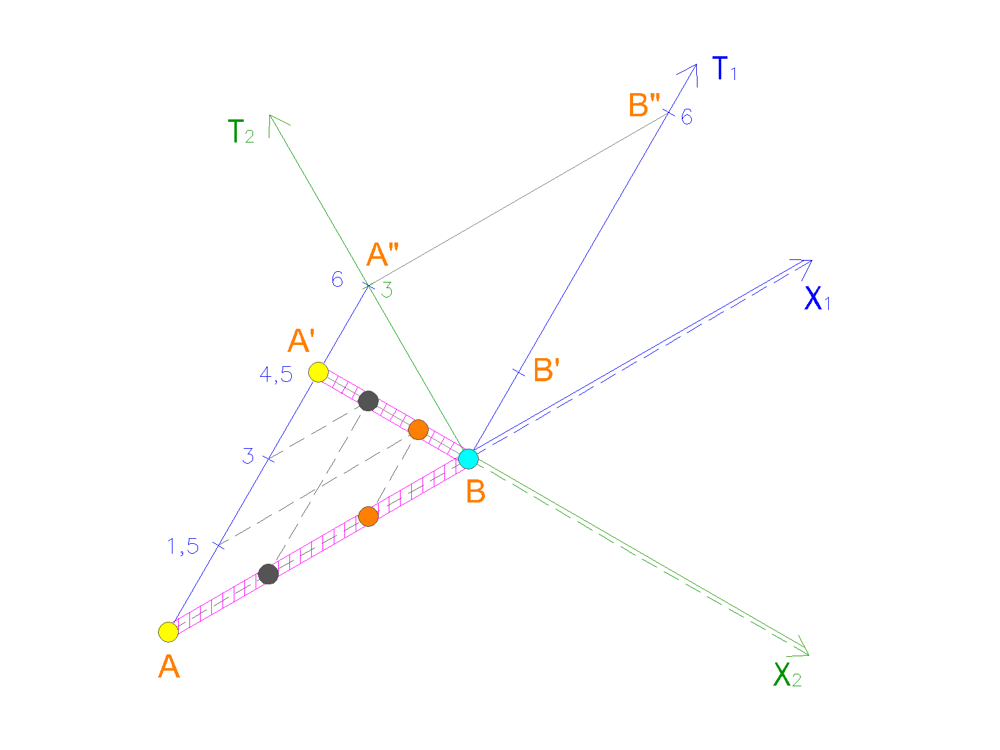

A régua $AB$ está fixa no referencial $X_1$,$T_1$ (azul) e seus relógios estão sincronizados. O referencial azul desloca-se em relação ao referencial $X_2$,$T_2$, (verde, fixo), fazendo com que a régua também se desloque.
No referencial verde, no instante $T_2$=0, a régua $AB$ está sendo representada por $A^{'}B$ no eixo $X_2$. Esta régua $A^{'}B$, medida neste referencial, terá um comprimento de 2,6 metros.
Quatro relógios, representados por círculos coloridos sobre $A^{'}B$, estão dessincronizados no referencial verde e mostram, no tempo $T_2$ = 0 segundos:
$T_1$=0 segundos no relógio azul (ponto $B$).
$T_1$=1,5 segundos no relógio alaranjado.
$T_1$=3 segundos no relógio preto.
$T_1$=4,5 segundos no relógio amarelo (ponto $A^{'}$).

### Desenho II-1 •  Leitura dos tempos do foguete a partir do referencial fixo

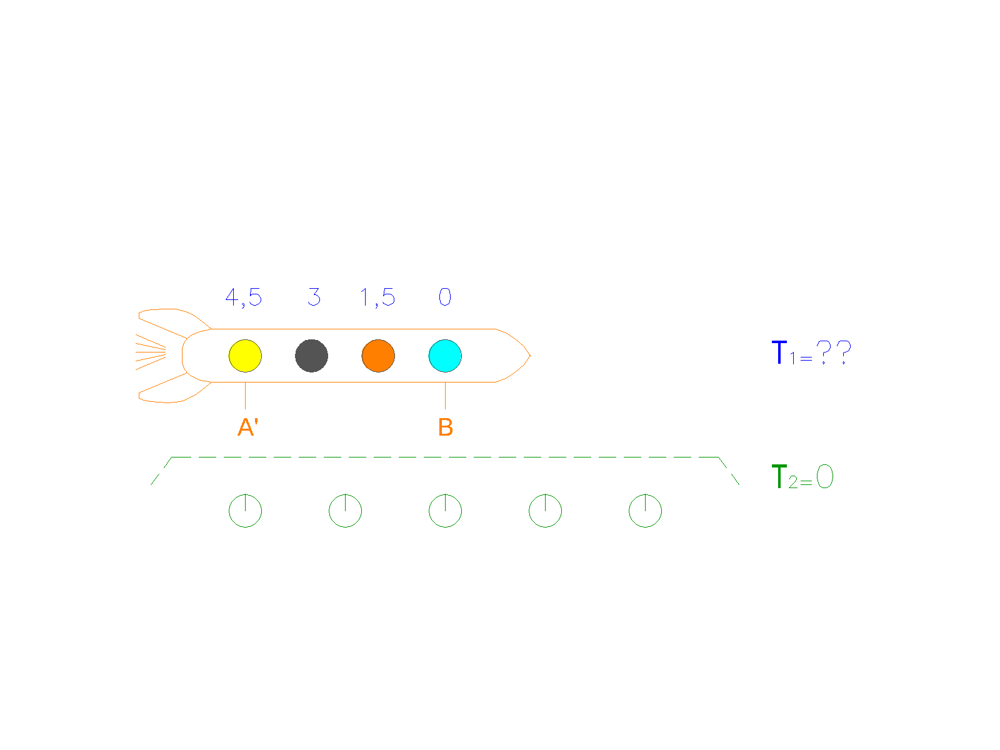

Neste desenho, um foguete substitui a régua $A^{'}B$ representada no Gráfico II-7, no instante $T_2$=0.
O foguete está sendo observado a partir do referencial verde fixo e os círculos verdes representam relógios que indicam o tempo neste referencial.
Cada um dos relógios coloridos, desenhados ao longo do foguete, mostra instantes diferentes que correspondem à leitura do tempo no eixo $T_1$ do referencial azul.
Nota-se que não é possível definir um único horário no referencial azul móvel, se o foguete estiver sendo observado a partir do referencial verde fixo.

### Gráfico II-8 •  Representação de relógios num referencial fixo e num referencial móvel (2)

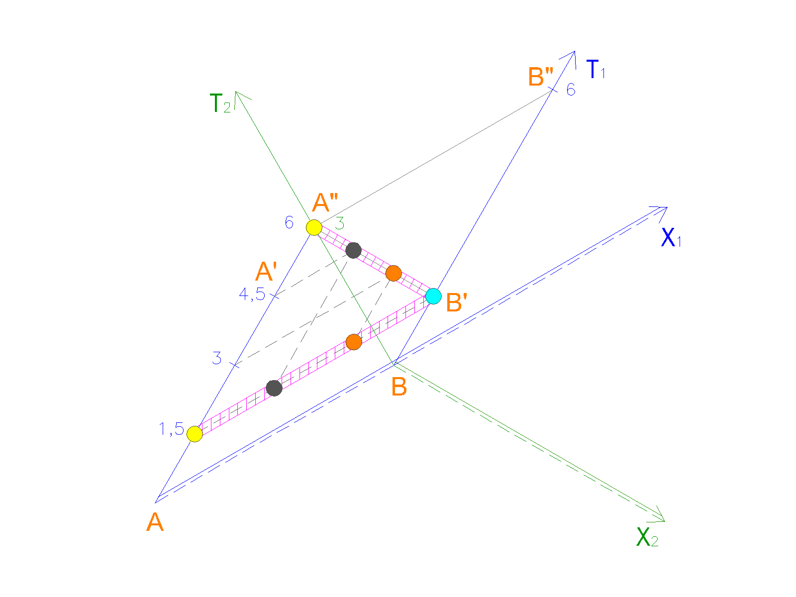

Os relógios coloridos da régua, fixa no referencial $X_1$,$T_1$ (azul, móvel), estão sincronizados. O referencial azul desloca-se em relação ao referencial $X_2$,$T_2$, (verde, fixo), fazendo com que a régua também se desloque.
No referencial verde, no instante $T_2$=3, a régua está sendo representada por $A^{''}B^{'}$ no eixo $X_2$. Esta régua $A^{''}B^{'}$, medida neste referencial, terá um comprimento de 2,6 metros.
Quatro relógios, representados por círculos coloridos sobre $A^{''}B^{'}$, estão dessincronizados no referencial verde e mostram, no tempo $T_2$=3:
$T_1$=6 no relógio amarelo (ponto $A^{''}$);
$T_1$=4,5 no relógio preto;
$T_1$=3 no relógio alaranjado;
$T_1$=1,5 no relógio azul (ponto $B^{'}$).

### Desenho II-2 •  Leitura dos tempos do foguete a partir do referencial fixo (T2=3)

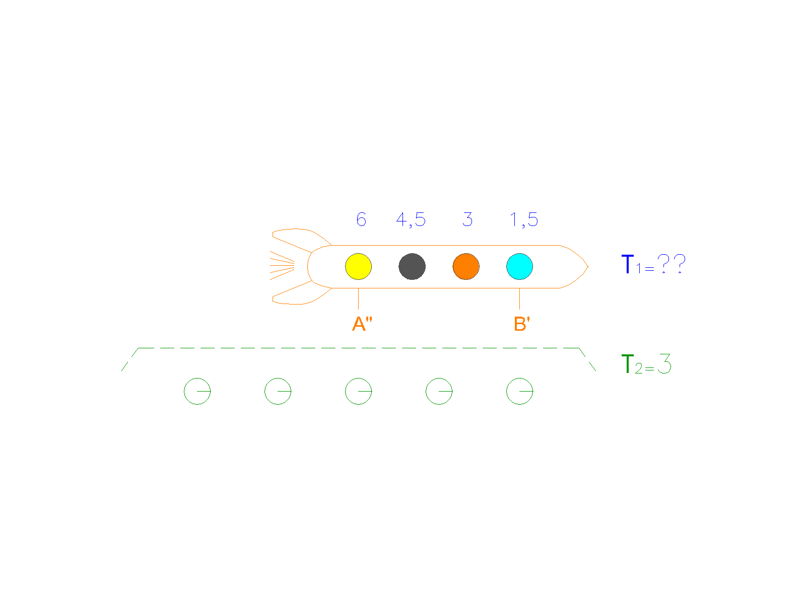

Neste desenho, um foguete substitui a régua $A^{''}B^{'}$ representada no Gráfico II-8, no instante $T_2$=3.
O foguete está sendo observado a partir do referencial verde fixo e os círculos verdes representam relógios que indicam o tempo neste referencial.
Cada um dos relógios coloridos, desenhados ao longo do foguete, mostra instantes diferentes que correspondem à leitura do tempo no eixo $T_1$ do referencial azul.
Nota-se que não é possível definir um único horário no referencial azul móvel, se o foguete estiver sendo observado a partir do referencial verde fixo.

### Desenho II-3 •  Relógios no referencial fixo e no referencial móvel (1)

Neste desenho, um foguete substitui as réguas $A^{'}B$ e $A^{''}B^{'}$, representadas nos Gráficos II-7 e II-8. O foguete desloca-se a alta velocidade ($V$=0,866c) para a direita. Os círculos verdes representam relógios que indicam os tempos no referencial verde fixo.
Cada um dos relógios coloridos, desenhados ao longo do foguete, mostra instantes diferentes, que correspondem à leitura do tempo no eixo $T_1$ do referencial azul.
Um observador 1, imóvel no referencial verde fixo, olha para os relógios coloridos que passam por ele. No tempo $T_2$=0, o relógio do observador e o relógio do foguete mostram o mesmo horário.
Passados 3 segundos no referencial verde ($T_2$=3), o relógio amarelo do foguete indica 6 segundos.
Assim, para o observador 1, o tempo no foguete parece passar duas vezes mais rápido.

### Desenho II-4 •  Relógios no referencial fixo e no referencial móvel (2)

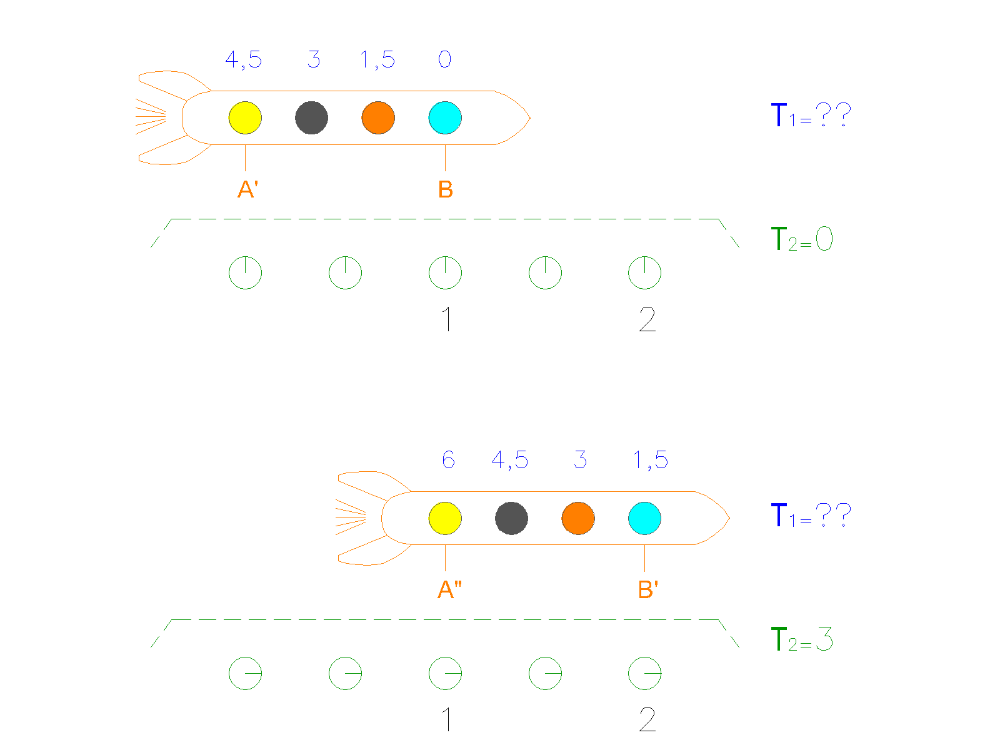

Neste desenho, semelhante ao anterior, dois observadores, 1 e 2, imóveis em lugares diferentes do referencial verde fixo, registram o tempo de um único relógio azul situado à frente do foguete, quando este passa por eles. No tempo $T_2$=0, o relógio do observador 1 e o relógio do foguete mostram o mesmo horário. O observador 2, posicionado mais à frente, ainda não vê o foguete.
Passados 3 segundos no referencial verde ($T_2$=3), o mesmo relógio azul do foguete que passa em frente ao observador 2 marca 1,5 segundos.
Comparando os seus registros, os observadores ficam com a impressão de que o tempo no foguete passa duas vezes mais lentamente, pois após 3 segundos no referencial verde, o relógio situado à frente do foguete indica 1,5 segundos.

### Gráfico II-9 •  Contração aparente do comprimento

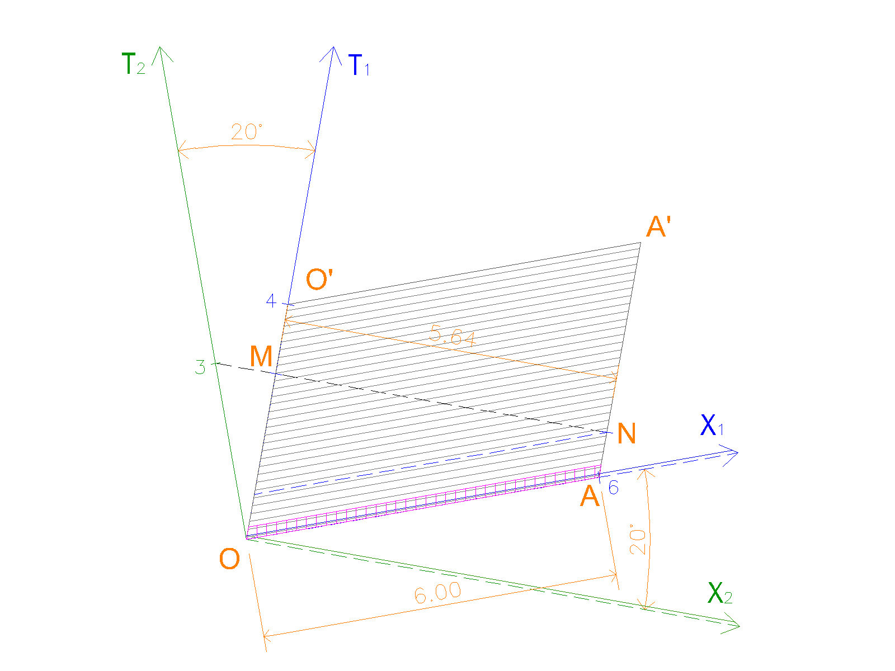

Neste gráfico o referencial $X_1$,$T_1$ (azul, móvel) desloca-se em relação ao referencial $X_2$,$T_2$ (verde, fixo) numa velocidade de 0,342c (seno do ângulo de 20°, formado pelas coordenadas $T_1$ e $T_2$).
Uma régua $OA$ medindo 6 metros de comprimento está fixa no referencial azul e após 4 segundos estará em $O^{'}A^{'}$.
Para medir o comprimento desta régua no referencial verde, será necessário medir as posições de $O$ e de $A$ no mesmo instante deste referencial (por exemplo, no tempo $T_2$=3).
O segmento $MN$ corresponde à régua $OA$ observada no tempo $T_2$=3 do referencial verde. Os pontos $M$ e $N$, entretanto, estão em diferentes instantes no referencial azul.
Nota-se que o comprimento do segmento $MN$ (5,64 metros) é menor do que o da régua $OA$ e corresponde ao produto do comprimento da régua original (6 metros) pelo cosseno do ângulo formado entre os eixos $X_1$ e $X_2$ (6xcos20°=6x0,9396=5,64).
### Gráfico II-10 •  Exemplo da contração aparente do comprimento

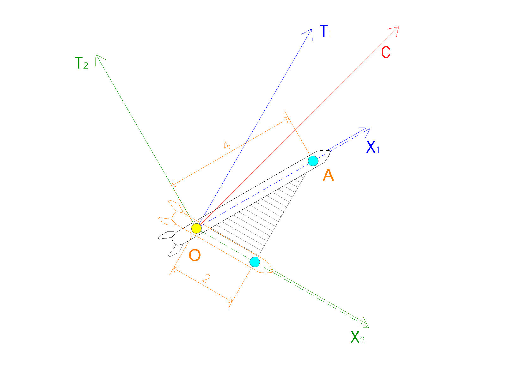

Neste gráfico, um foguete com relógios coloridos nas posições $O$ e $A$, está representado no eixo $X_1$ do referencial azul móvel. O foguete é visto a partir da Terra, aqui representada pelo referencial verde fixo.
O referencial azul, que nada mais é do que o próprio foguete, desloca-se a uma velocidade de 0,866c em relação ao referencial verde (o ângulo formado pelas coordenadas $T_1$ e $T_2$ mede 60°, então, $V$=sen60°=0,866).
As posições $O$ e $A$ do foguete devem ser medidas, conforme vimos no gráfico anterior, no mesmo instante dos dois referenciais, neste caso, $T_1$=$T_2$=0.
No tempo $T_1$=0, a distância $OA$ no referencial azul é de 4 metros. Visto da Terra, esta distância parece ser, no tempo $T_2$=0, a metade do comprimento original, ou seja, de apenas 2 metros.
Nota-se que o comprimento do foguete visto da Terra (referencial verde) é menor do que o comprimento do foguete no referencial azul e corresponde, conforme já vimos no gráfico anterior, ao produto do comprimento do foguete original pelo cosseno do ângulo formado entre os eixos $X_1$ e $X_2$.

### Gráfico II-11 •  Exemplo da dilatação aparente do comprimento

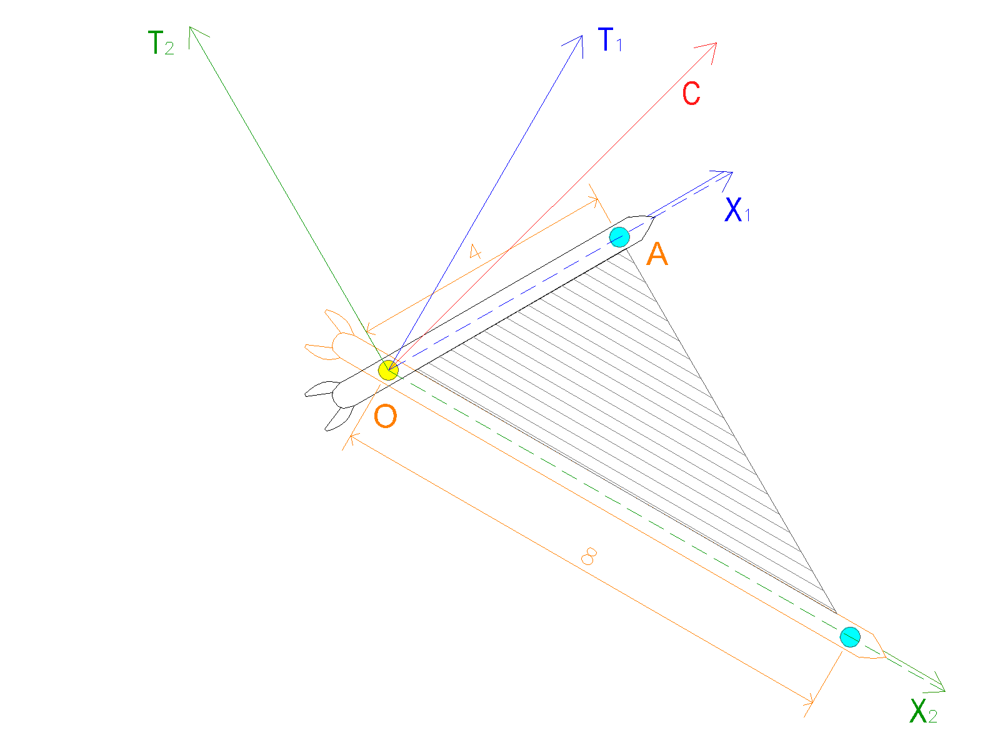

Também neste gráfico o referencial $X_1$,$T_1$ (azul, móvel) desloca-se em relação à Terra (referencial $X_2$,$T_2$, verde, fixo) numa velocidade de 0,866c.
Diferentemente do gráfico anterior, a Terra é vista a partir do foguete, aqui representado pelo referencial azul, móvel.
No tempo $T_1$=0, as posições $O$ e $A$ do foguete em movimento são projetadas, a partir do foguete, no eixo $X_2$ do referencial verde (Terra).
A seguir, a distância $OA$ do foguete original (4 metros), é comparada com a distância $OA$ projetada na Terra ($OA$/cos60⁰=8 metros) e verifica-se que o foguete parece mais comprido do que realmente é, apresentando o dobro do comprimento.

### Gráfico II-12 •  Dilatação aparente do tempo

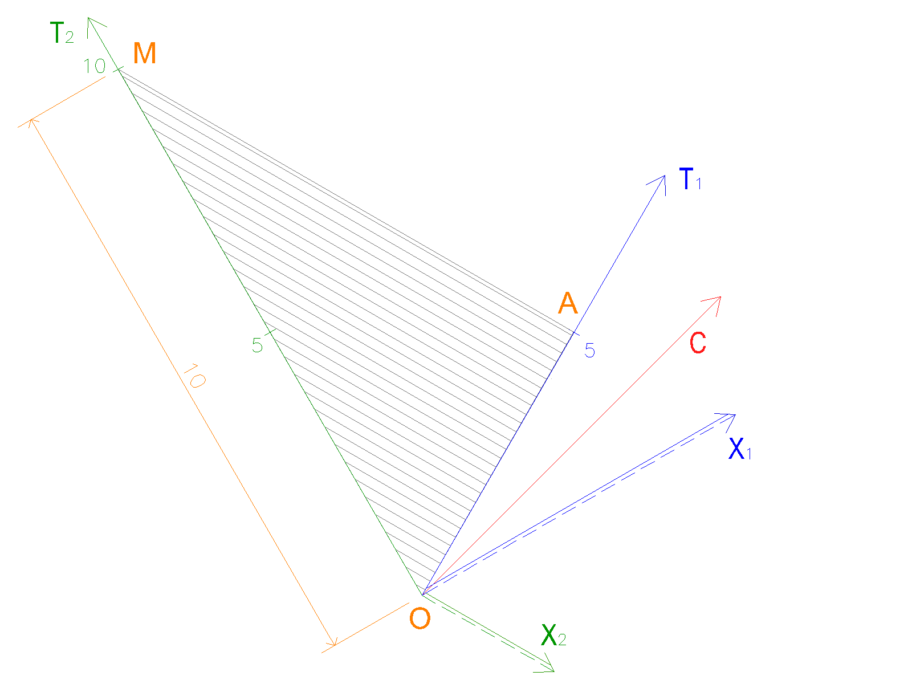

Temos dois referenciais, $X_1$, $T_1$ (azul, móvel) e $X_2$, $T_2$ (verde, fixo). O referencial azul desloca-se em relação ao referencial verde numa velocidade $V$=0,866c.
Um ponto fixo (uma partícula, por exemplo), cujo envelhecimento está representado em $OA$ no eixo $T_1$, tem uma vida de 5 segundos no referencial azul e de 10 segundos no referencial verde ($OM$).
A diferença de tempo nos dois referenciais (dilatação aparente do tempo) corresponde ao quociente do tempo original (5 segundos) pelo cosseno do ângulo formado pelos eixos $T_1$ e $T_2$, neste caso, cos60⁰ (5/cos60⁰=5/0,5=10).
### Gráfico II-13 •  Exemplo da dilatação aparente do tempo

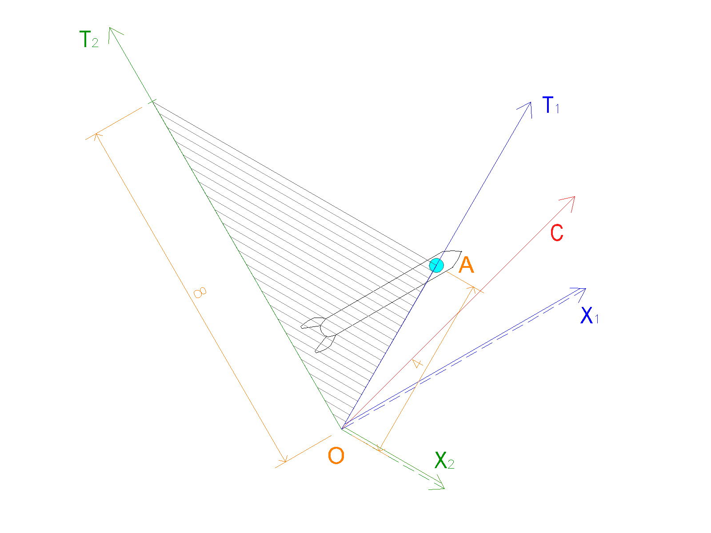

Neste gráfico, exemplificamos como a leitura de um relógio situado na proa de um foguete, aqui representado pelo referencial azul móvel, é feita a partir do referencial verde fixo (Terra).
O referencial azul, que nada mais é do que o próprio foguete, desloca-se a uma velocidade de 0,866c em relação ao referencial verde.
Enquanto o relógio do foguete envelhece 4 segundos no referencial azul móvel ($T_1$=4), no referencial verde fixo ele envelhece 8 segundos ($T_2$=8).

### Gráfico II-14 •  Exemplo da contração aparente do tempo

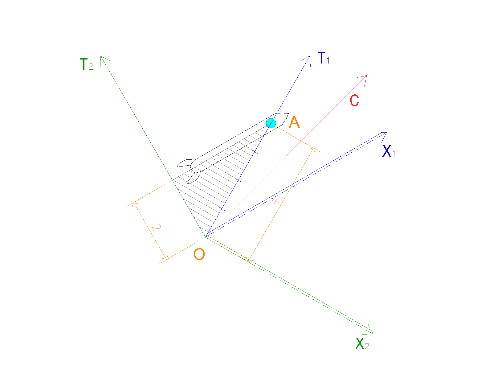

Neste gráfico, os relógios do referencial verde fixo (Terra) são vistos a partir do foguete em movimento (velocidade de 0,866c).
Quando, no tempo $T_1$=4, um astronauta situado na proa do foguete olha para a Terra, vê relógio deste referencial fixo marcando $T_2$=2. 

### Gráfico II-15 •  Dessincronização (T2=0s)

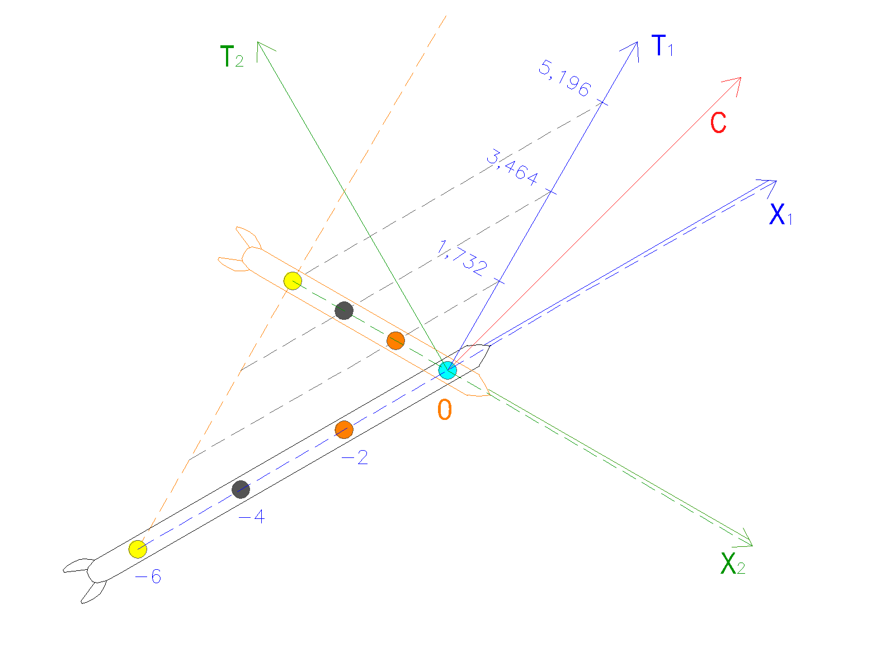

Neste gráfico, um foguete está fixo no referencial $X_1$,$T_1$ (azul, móvel). O referencial azul, que se confunde com o próprio foguete, desloca-se em relação ao referencial $X_2$,$T_2$ (verde, fixo), numa velocidade de 0,866c. A reta vermelha representa a velocidade da luz ($c$).
O gráfico mostra uma imagem instantânea do foguete. Nesta imagem, vários relógios coloridos, espaçados em 2 metros, estão sincronizados no tempo $T_1$=0 do referencial azul.
Vistos a partir do referencial verde, cada relógio do foguete está defasado em relação ao relógio vizinho em 1,732 segundos para cada metro de distância que os separa.
A taxa de dessincronização do referencial azul em relação ao verde (1,732), corresponde à tangente do ângulo formado entre os eixos $X_1$ e $X_2$, neste caso um ângulo de 60 graus.

### Desenho II-5 •  Dessincronização (T2=0s)

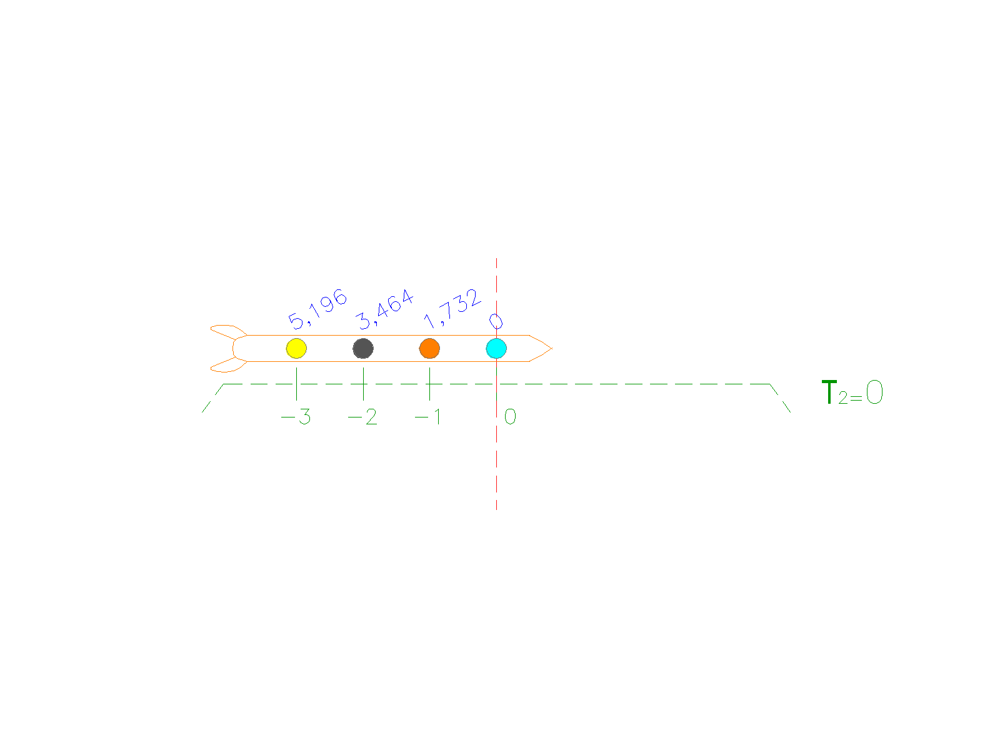

O desenho ilustra o Gráfico II-15 e mostra os relógios do foguete que marcam horários diferentes (dessincronizados) quando vistos do referencial verde no tempo $T_2$=0.
Um observador, imóvel no ponto 0 do referencial verde, vê o foguete menor (metade do tamanho original) e com os relógios dessincronizados.
### Gráfico II-16 •  Dessincronização (T2=1,155s)

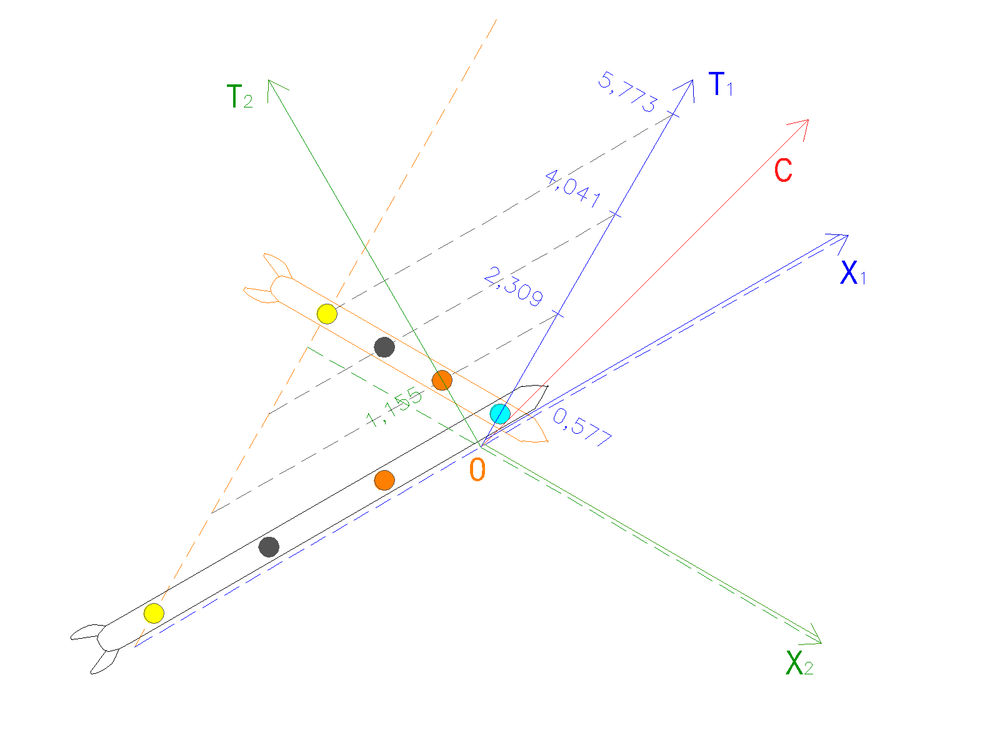

Este gráfico, semelhante ao anterior, mostra o passar do tempo ou envelhecimento do foguete nos referenciais $X_1$, $T_1$ (azul, móvel) e $X_2$, $T_2$ (verde, fixo).
Vistos a partir do referencial verde, no tempo $T_2$=1,155, cada relógio continua defasado em relação ao relógio vizinho em 1,732 segundos para cada metro de distância que os separa (a taxa de dessincronização do referencial azul em relação ao verde permanece a mesma).

### Desenho II-6 •  Dessincronização (T2=1,155s)

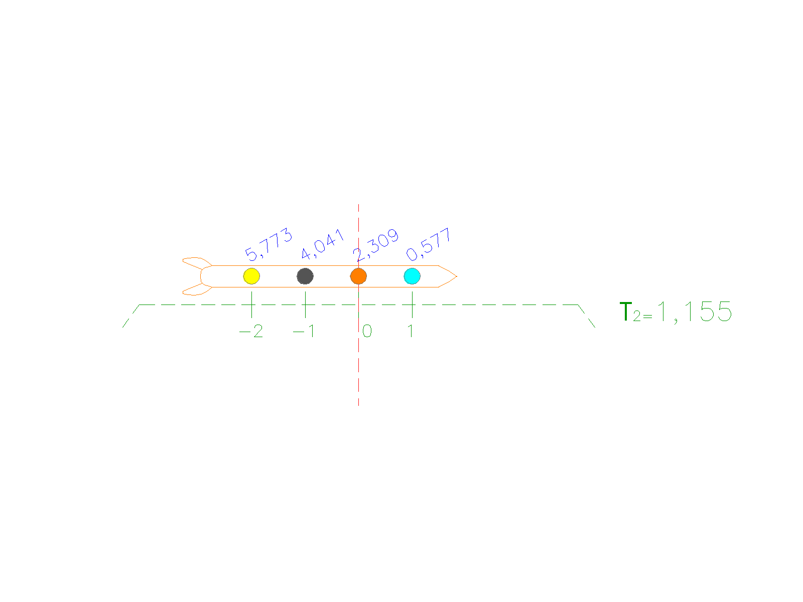

O desenho ilustra o Gráfico II-16 e mostra os relógios do foguete que marcam horários diferentes (dessincronizados) quando vistos do referencial verde no tempo $T_2$=1,155.
Um observador, imóvel no ponto 0 do referencial verde fixo, vê o relógio do foguete que passa na sua frente marcando o dobro do seu tempo. Entretanto, o relógio azul que já passou por ele, localizado na proa do foguete, marca a metade do seu tempo.

### Gráfico II-17 •  Dessincronização (T2=2,309s)

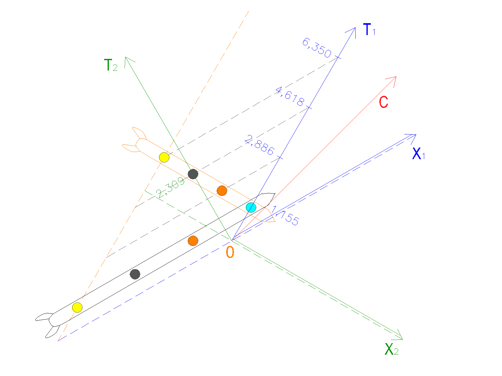

Este gráfico, semelhante aos dois anteriores, mostra a continuidade de envelhecimento do foguete nos referenciais $X_1$,$T_1$ (azul, móvel) e $X_2$,$T_2$ (verde, fixo).
Vistos a partir do referencial verde no tempo $T_2$=2,309, cada relógio continua defasado em relação ao relógio vizinho em 1,732 segundos para cada metro de distância que os separa.
### Desenho II-7 •  Dessincronização (T2=2,309s)

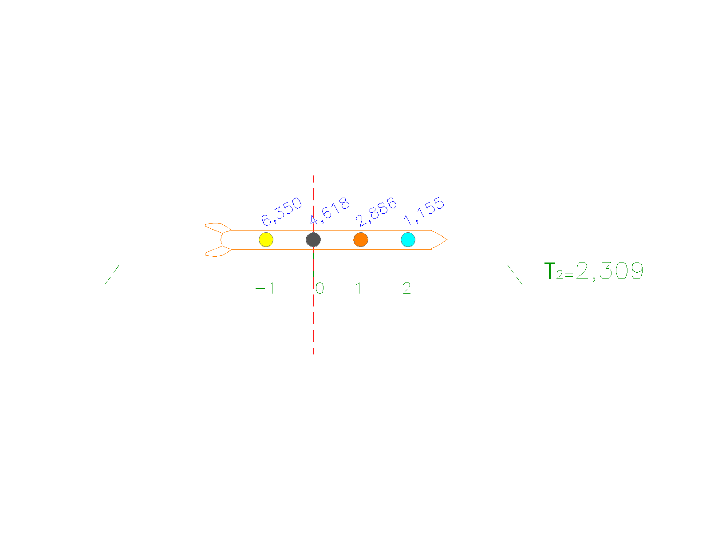

O desenho ilustra o Gráfico II-17 e mostra os relógios do foguete que marcam horários diferentes (dessincronizados) quando vistos do referencial verde fixo no tempo $T_2$=2,309.
Aqui também, um observador que se encontra imóvel no ponto 0 do referencial verde fixo (Terra), vê o relógio do foguete que passa na sua frente marcando o dobro do seu tempo. Entretanto, o relógio azul, que já passou por ele, localizado na proa do foguete, marca a metade do seu tempo.

### Gráfico II-18 •  Dessincronização (T2=3,464s)

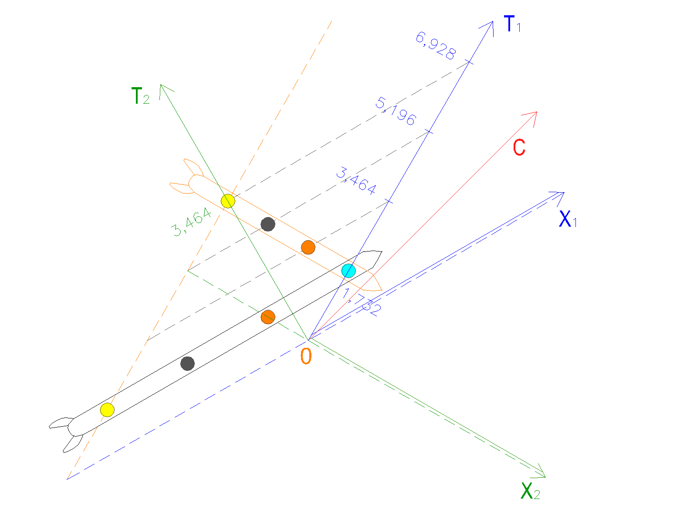

Este gráfico, semelhante aos três anteriores, mostra a continuidade de envelhecimento do foguete nos referenciais $X_1$, $T_1$ (azul, móvel) e $X_2$, $T_2$ (verde, fixo).
O foguete continua imóvel no referencial azul que desloca-se em relação ao verde numa velocidade de 0,866c. Vistos a partir do referencial verde no tempo $T_2$=3,464, cada relógio continua defasado em relação ao relógio vizinho em 1,732 segundos para cada metro de distância que os separa.

### Desenho II-8 •  Dessincronização (T2=3,464s)

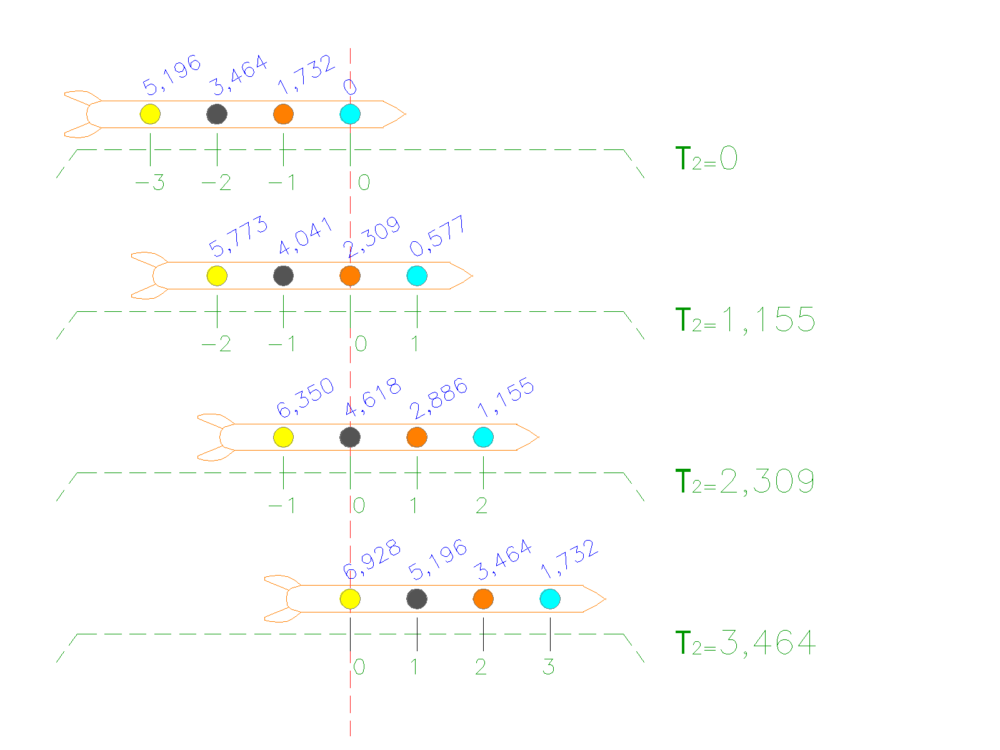

O desenho mostra os relógios do foguete que marcam horários diferentes (dessincronizados) quando vistos do referencial verde fixo nos tempos:
$T_2$=0 segundos.
$T_2$=1,155 segundos.
$T_2$=2,309 segundos.
$T_2$=3,464 segundos.
Generalizando, a tangente do ângulo formado entre os eixos $X_1$ e $X_2$, (tg60°=1,732), indica a taxa de dessincronização do referencial azul em relação ao verde.
### Desenho II-9 •  Como se modifica o tempo para um astronauta

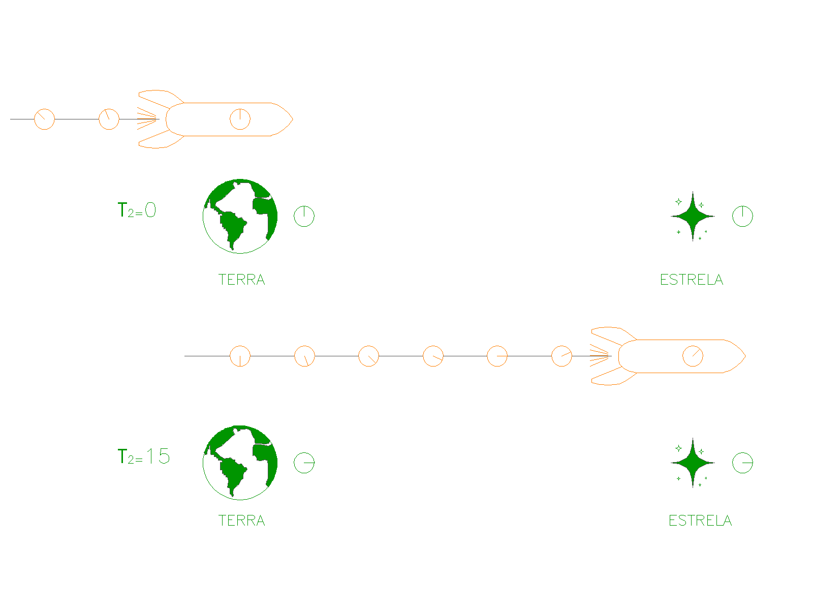

Vamos supor que um astronauta passe pela Terra em um foguete que desloca-se em velocidade próxima à da luz, rumo a uma estrela. O foguete arrasta uma corrente com relógios sincronizados em relação a ele. Um observador na Terra analisa a passagem do tempo no foguete, olhando para os relógios que desfilam em sua frente.
De maneira estranha, para o observador na Terra, o astronauta parece envelhecer mais rápido do que ele. No tempo $T_2$=0, o relógio que passa por ele marca $T_1$=0 e no tempo $T_2$=15, o relógio que passa por ele marca $T_1$=30.

Paradoxalmente, em relação à Terra, o astronauta parece chegar ao destino num intervalo de tempo menor, ou seja, sua viagem ficará mais curta e o foguete chegará na estrela no tempo $T_2$=15, com o seu relógio marcando $T_1$=7,5. Em outras palavras, o observador na Terra parece envelhecer mais rápido do que o astronauta.
Esta contradição nos faz questionar o conceito de dilatação do tempo.

### Gráfico II-19 •  Mais rápido do que a velocidade da luz?

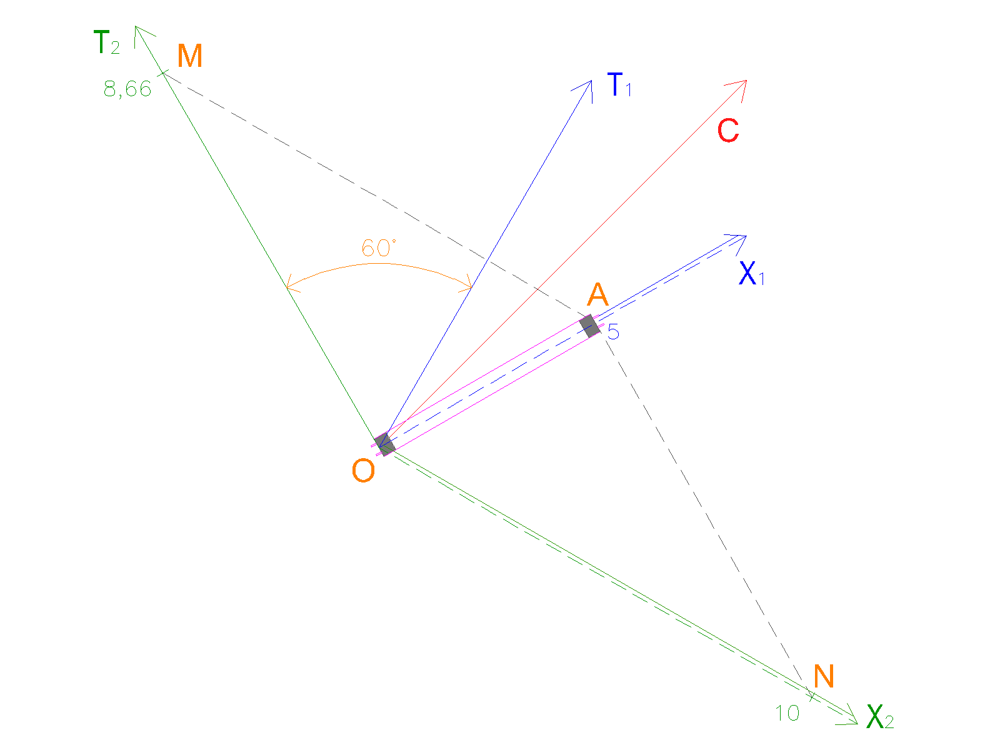

Temos dois referenciais $X_1$, $T_1$ (azul, móvel) e $X_2$, $T_2$ (verde, fixo). O referencial azul desloca-se em relação ao verde numa velocidade de 0,866c. A reta vermelha representa a velocidade da luz ($c$).
Uma lâmpada fluorescente com 5 metros de comprimento ($OA$), fixa no referencial azul, pisca no tempo $T_1$=0.
No referencial verde, a luz emitida vai ser vista como um ponto luminoso deslocando-se numa extensão ($X_2$) de 10 metros ($ON$), durante um tempo ($T_2$) de 8,66 segundos ($OM$), numa velocidade maior do que a velocidade da luz (10/8,66=1,1547).

### Desenho II-10 •  Relatividade da simultaneidade (1)

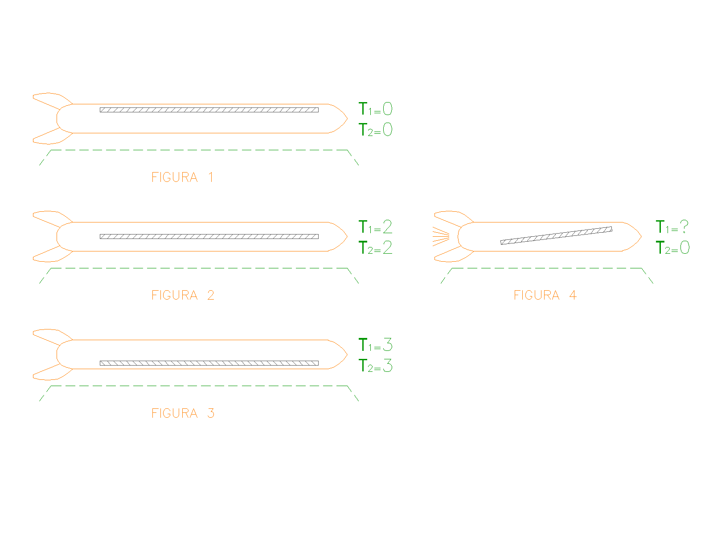

As figuras 1, 2 e 3 mostram uma barra rígida dentro de um foguete imóvel. Neste foguete, a barra está caindo horizontalmente. As três figuras mostram as posições da barra antes de chegar no piso.
A figura 4 mostra a mesma experiência em relação a um referencial fixo quando o foguete desloca-se a alta velocidade.
Nesta experiência, o foguete parece mais curto e a barra não cai horizontalmente, uma extremidade atinge o piso antes da outra. Isso acontece porque um observador, posicionado em um referencial fixo, vê cada parte do foguete em diferentes instantes (relatividade da simultaneidade).

### Desenho II-11 •  Relatividade da simultaneidade (2)

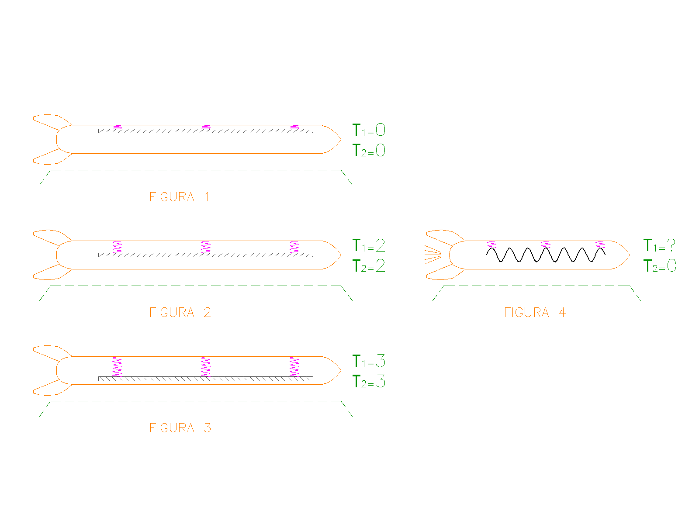

As figuras 1, 2 e 3 mostram uma barra rígida dentro de um foguete imóvel. A barra está fixa com molas na parte superior do foguete e fica na posição horizontal subindo e descendo. As três figuras mostram várias posições desta barra.
A figura 4 mostra a mesma experiência em relação a um referencial fixo quando o foguete desloca-se a alta velocidade.
Nesta experiência o foguete parece mais curto e a barra adquire um aspecto sinuoso. Isso acontece porque vemos cada parte do foguete em diferentes instantes em relação ao foguete (relatividade da simultaneidade).

### Gráfico II-20 •  Adição de velocidades

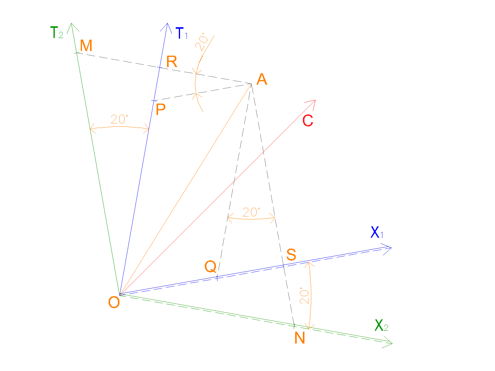

Temos dois referenciais $X_1$, $T_1$ (azul, móvel) e $X_2$, $T_2$ (verde, fixo).  A velocidade do referencial azul em relação ao verde ($V_1$) corresponde, como já vimos anteriormente, ao seno do ângulo formado entre as coordenadas $X_1$ e $X_2$ ($V_1$=sen20°).
O ponto $A$ desloca-se no referencial azul numa velocidade $V_2$=$OQ$/$OP$.
Em relação ao referencial verde, a velocidade do ponto $A$ ($V_3$) é dada graficamente pelo quociente de $ON$/$OM$.
Podemos fazer as seguintes relações trigonométricas:
$ON$xcos20°=$OS$
$OM$xcos20°=$OR$
$V_3$=$ON$/$OM$=$OS$/$OR$
$V_3$=($OQ$+$QS$)/($OP$+$PR$)
$V_3$=($OQ$+$QA$xsen20°)/($OP$+$PA$xsen20°)
$QA$=$OP$;$PA$=$OQ$
$V_3$=($OQ$+$OP$xsen20°)/($OP$+$OQ$xsen20°)
Se dividirmos todos os termos da equação acima por $OP$, teremos, após simplificação:
$V_3$=[($OQ$/$OP$)+sen20°]/[($OP$/$OP$)+]($OQ$/$OP$xsen20°)
Esta equação corresponde à fórmula de adição de velocidades na relatividade:
$V_3$=($V_2$+$V_1$)/[1+($V_2$x$V_1$)]
### Gráfico II-21 •  Velocidade intermediária em relação a dois referenciais

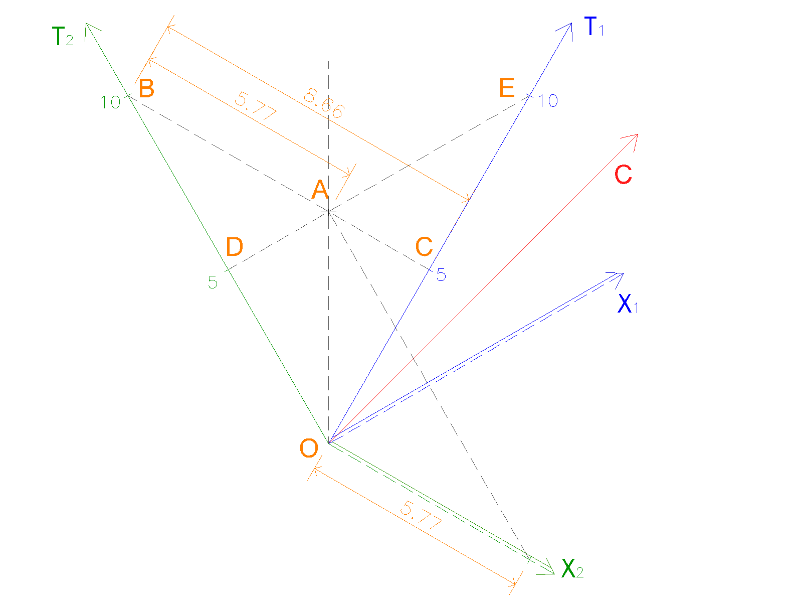

Temos dois referenciais $X_1$,$T_1$ (azul, móvel) e $X_2$,$T_2$ (verde, fixo). A velocidade do referencial azul em relação ao verde ($V_1$) é dada por $BC$/$OB$ = 0,866 e corresponde, conforme já vimos anteriormente, ao seno do ângulo formado entre as coordenadas $X_1$ e $X_2$ ($V_1$=sen60°).
Partindo das relações trigonométricas:
$DA$=$BA$xcos60°
$OD$=$OE$xcos60°
$DA$/$OD$=$BA$xcos60°/$OE$xcos60°
$DA$/$OD$=$BA$/$OE$ (1)
$DA$/$OD$=tg30°
A linha $OA$ representa uma velocidade intermediária $V_2$ que tem o mesmo valor em relação aos dois referenciais, azul e verde. A velocidade $V_2$ de $A$ em relação ao referencial verde é dada por $BA$/$OB$. Como no ponto $A$, $T_1$=$OE$=$T_2$=$OB$, substituindo $OE$ por $OB$ em (1), teremos: $BA$/$OB$=tg30°.
Assim, $V_2$=tg30°=0,577.
Substituindo na fórmula de adição de velocidades ($V_1$=$V_2$+$V_2$/(1+$V_2$x$V_2$):
$V_1$=($BA$/$OB$+$BA$/$OB$)/(1+$BA$/$OB$x$BA$/$OB$)
$V_1$=(0,577+0,577)/(1+0,577x0,577)=0,866=sen60°
A fórmula de adição de velocidades da relatividade restrita pode, assim, ser representada graficamente.
### Gráfico II-22 •  Dois foguetes fixos em diferentes referenciais (velocidade relativa de 0,866c)

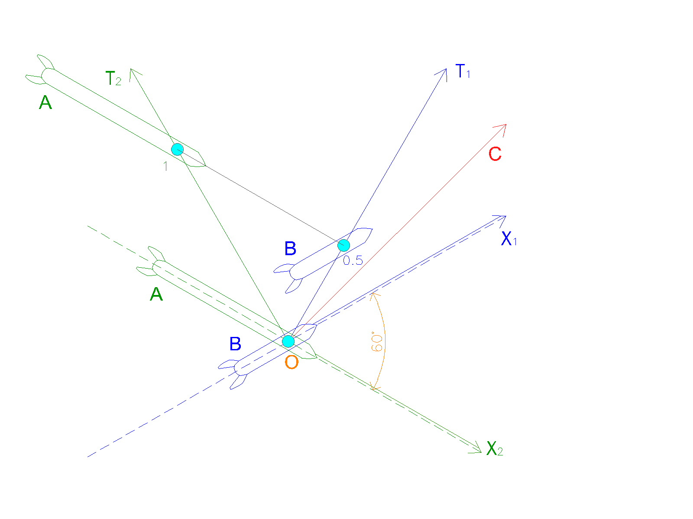

Temos dois referenciais, $X_1$, $T_1$ (azul, móvel) e $X_2$, $T_2$ (verde, fixo). No gráfico, dois foguetes (azul e verde) estão fixos em seus respectivos referenciais em dois diferentes momentos.
O referencial azul, que se confunde com o próprio foguete $B$, desloca-se numa velocidade $V_1$ de 0,866c (seno do ângulo de 60°) em relação ao referencial verde (Terra), onde um foguete $A$ permanece imóvel. Um relógio azul, localizado na proa dos foguetes, indica o quanto eles parecem envelhecer.
Vamos supor que esta situação permaneça por um ano no referencial verde (Terra).
Para determinar o envelhecimento aparente do foguete $B$ em relação ao foguete $A$ (Terra), basta achar o cosseno do ângulo que determina a velocidade.
Assim, o foguete $B$ parece envelhecer menos do que o foguete $A$, ou seja, para achar $T_1$ é necessário multiplicar o tempo $T_2$ pelo cos60°=0,5 ($T_1$=1 anox0,5=meio ano).

### Gráfico II-23 •  Dois foguetes fixos em diferentes referenciais (velocidade relativa de 0,577c)

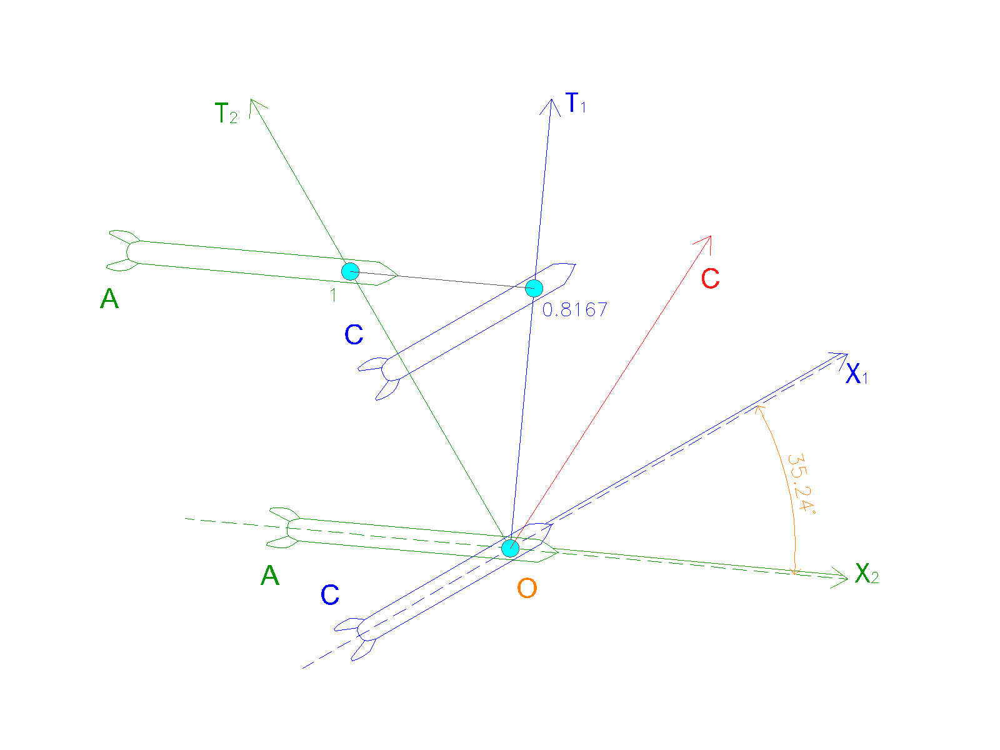

Temos dois referenciais, $X_1$, $T_1$ (azul, móvel) e $X_2$, $T_2$ (verde, fixo). No gráfico, dois foguetes (azul e verde) estão fixos em seus respectivos referenciais em dois diferentes momentos.
O referencial azul, que se confunde com o próprio foguete $C$, desloca-se numa velocidade $V_1$ de 0,577c (seno do ângulo de 35,24°) em relação ao referencial verde (Terra), onde um foguete $A$ permanece imóvel. Um relógio localizado na proa dos foguetes indica o quanto eles parecem envelhecer.
Vamos supor que esta situação permaneça por um ano no referencial verde (Terra).
Para determinar o envelhecimento aparente do foguete $C$ em relação ao foguete $A$ (Terra), basta achar o cosseno do ângulo que determina a velocidade.
Assim, o foguete $C$ parece envelhecer menos do que o foguete $A$, ou seja, para achar $T_1$ é necessário multiplicar o tempo $T_2$ pelo cos35,24°:
($T_1$=1 anox0,8167=0,8167 ano).

### Desenho II-12 •  Velocidades intermediárias e dilatação do tempo

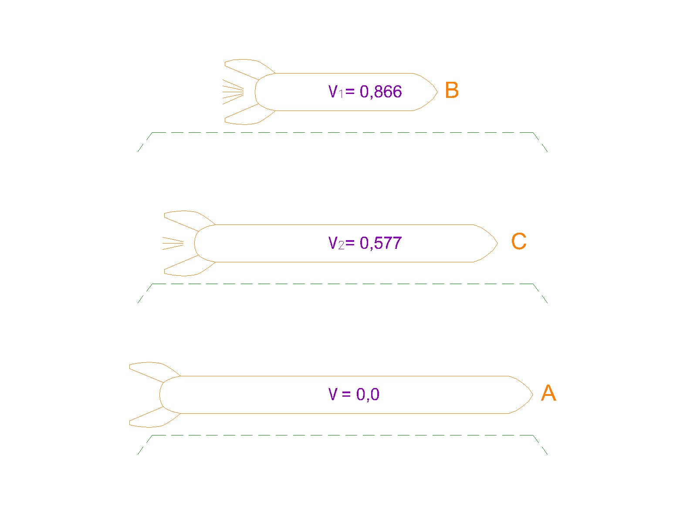

Este desenho ilustra os foguetes representados nos Gráficos II-22 e II-23.
O foguete $A$ está imóvel na Terra e o foguete $B$ desloca-se numa velocidade $V_1$=0,866c (Gráfico II-22).
O foguete $C$ desloca-se em relação ao foguete $A$ numa velocidade intermediária $V_2$=0,577c3, igual à velocidade do foguete $C$ em relação ao foguete $B$ (Gráfico II-23).
Vamos supor que esta situação permaneça por um ano do referencial Terra. O foguete $A$, que permanece imóvel na Terra, também vai envelhecer um ano.
Conforme vimos no Gráfico II-22, o foguete $B$ parece envelhecer menos, ou seja, parece ficar meio ano (cos60°) mais velho (1 anox0,5=meio ano).
O foguete $C$ também parece envelhecer menos do que o foguete $A$ (Gráfico II-23), ou seja, parece ficar 0,8167 ano (cos35,24°) mais velho (1 anox0,8167=0,8167 ano).
Como a velocidade do foguete $C$ é intermediária, podemos admitir que, em relação a ele, o foguete $B$ apresentaria a mesma taxa de envelhecimento (0,8167 ano).
Isto posto, poderíamos concluir que, em relação à Terra, o foguete $B$ envelheceria 0,666 ano em vez de 0,5 ano, considerando o produto do envelhecimento sucessivo de $C$ em relação a $A$ e de $C$ em relação a $B$ (0,8167x0,8167).

Temos aqui uma contradição, pois são dois resultados de envelhecimento diferentes do foguete $B$ em relação ao foguete $A$: 0,5 e 0,666 ano. Qual seria o verdadeiro?

### Desenho II-13 •  Velocidades intermediárias e dilatação do tempo

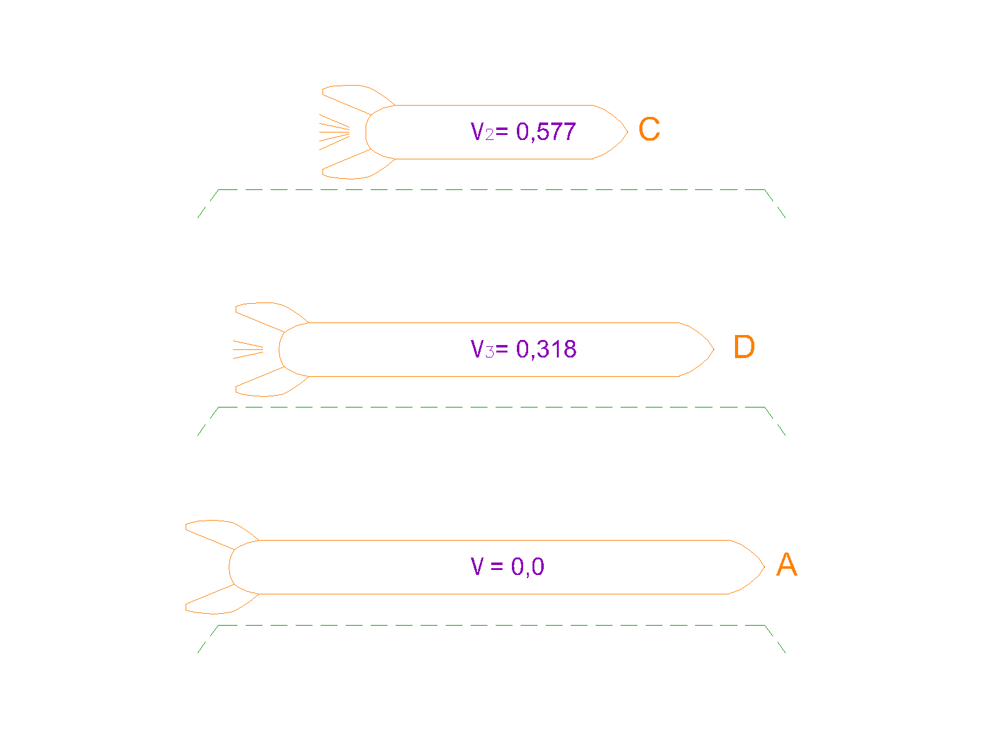

Ao acrescentarmos mais dois foguetes, o primeiro entre $A$ e $C$ (foguete $D$, representado no desenho) e o segundo entre $C$ e $B$, com velocidades intermediárias de 0,318c de um em relação ao outro, a taxa de envelhecimento entre eles seria de 0,9481, o que representaria, na relação entre $A$ e $B$, um total de 0,8080 (0,94814) ano em vez de 0,5 ano.
Podemos continuar desta forma colocando mais foguetes com velocidades intermediárias e vamos notar, a cada vez, uma diminuição no intervalo de envelhecimento do foguete $B$ em relação ao foguete $A$. Com 63 foguetes intermediários por exemplo, chegaríamos a um intervalo de envelhecimento de 0,9865 ano, valor que se aproxima de 1.

Estes resultados lançam dúvidas sobre se a taxa de envelhecimento é um fato e não simplesmente um efeito observacional.
Assim como um microscópio amplia uma imagem e não um objeto, a alta velocidade “dilata o tempo observado” de uma partícula, mas não o seu tempo de vida.
Uma alta velocidade permite que uma partícula seja observada por mais tempo, entretanto, não aumenta o seu tempo de vida, assim como um microscópio amplia uma dimensão observada (imagem) e não o objeto em si.
A “dilatação do tempo” deveria ser pensada assim.

### Gráfico II-24 •  Transformação das frequências

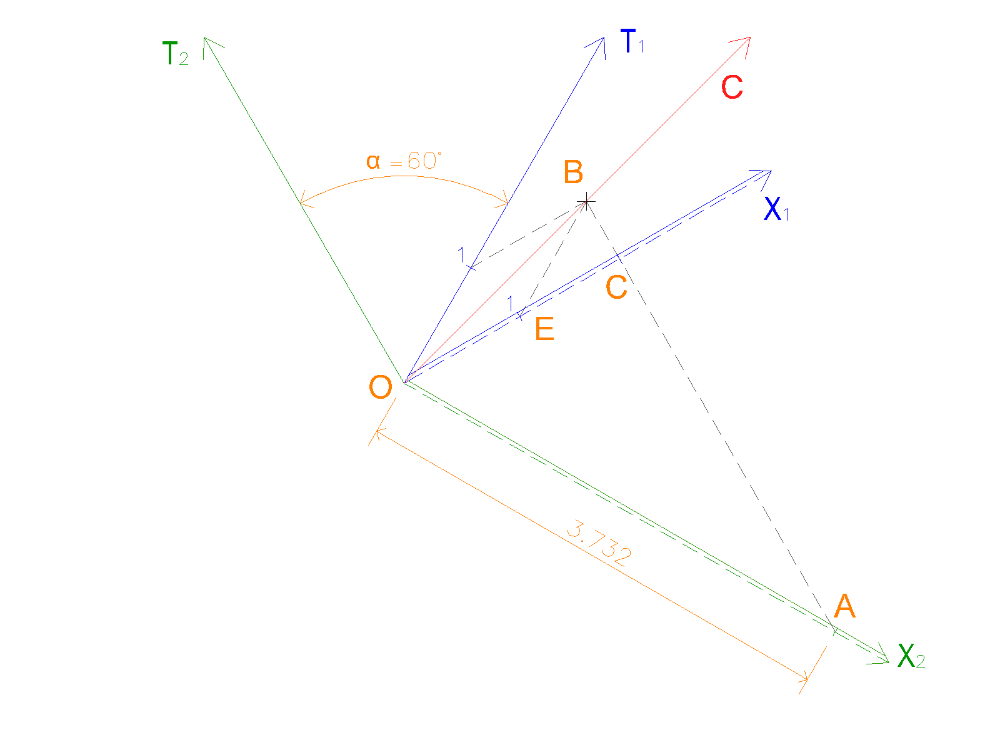

Temos dois referenciais $X_1$,$T_1$ (azul, móvel) e $X_2$,$T_2$ (verde, fixo). A velocidade $V_1$ do referencial azul em relação ao verde é igual a 0,866c, que corresponde ao seno do ângulo $\alpha$, formado entre as coordenadas $T_1$ e $T_2$.
A reta $OB$ representa uma onda luminosa emitida no referencial azul. O comprimento de onda está sendo representado por $OE$=1 no referencial azul e por $OA$ no referencial verde. Considerando tratar-se de um paralelogramo, $EB$=$OE$=1, então:
$OC$=$OE$+$EC$=1+$EB$sen60°=1+sen60°
$OA$=$OC$/cos60°=(1+sen60°)/cos60°=3,732
A onda luminosa de um referencial que se afasta será observada no referencial verde com um comprimento de onda $\lambda$=(1+sen$\alpha$)/cos$\alpha$) e com uma frequência $f$=cos$\alpha$/(1+sen$\alpha$)4.

### Gráfico II-25 •  Conservação da métrica relativística (X1²-T1²=X2²-T2²)

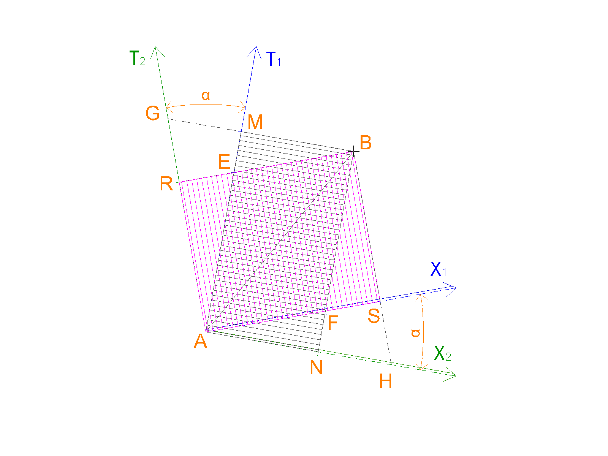

Temos dois referenciais $X_1$,$T_1$ (azul, móvel) e $X_2$,$T_2$ (verde, fixo). A velocidade $V_1$ do referencial azul em relação ao verde é igual ao seno do ângulo $\alpha$, formado entre as coordenadas $T_1$ e $T_2$.
Para qualquer evento $A$ com $X_1$=0; $T_1$=0 e $X_2$=0; $T_2$=0 e para qualquer evento $B$ com $X_1$=$EB$; $T_1$=$FB$ e $X_2$=$GB$; $T_2$=$HB$:
$MB$=$EB$cos$\alpha$=$X_1$cos$\alpha$
$NB$=$HB$cos$\alpha$=$T_2$cos$\alpha$
$RB$=$GB$cos$\alpha$=$X_2$cos$\alpha$
$SB$=$FB$cos$\alpha$=$T_1$cos$\alpha$
Como a reta $AB$ é a mesma diagonal para dois retângulos ($ANBM$) e ($ASBR$):
$MB$²+$NB$²=$RB$²+$SB$²
($X_1$)²cos²($\alpha$)+($T_2$)²cos²($\alpha$)=($X_2$)²cos²($\alpha$)+($T_1$)²cos²($\alpha$)
($X_1$)²+($T_2$)²=($X_2$)²+($T_1$)²
($X_1$)²-($T_1$)²=($X_2$)²-($T_2$)²
Concluindo, para referenciais que conservam a velocidade da luz, o valor do quadrado do espaço menos o valor do quadrado do tempo é sempre constante, ou seja, há conservação da métrica relativística ($X_1$²-$T_1$²=$X_2$²-$T_2$²).
### Gráfico II-26 •  Velocidade observada e velocidade percebida

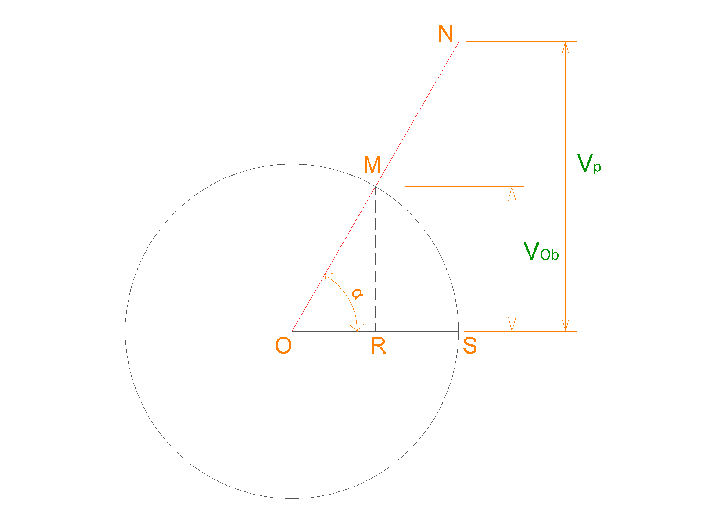

O esquema acima representa graficamente a relação entre uma velocidade observada $V_{ob}$5 e uma velocidade percebida $V_p$. A velocidade percebida será obtida pela integração das acelerações medidas a cada momento.
Seja uma circunferência de raio unitário ($OS$=1). Para qualquer velocidade observada, podemos definir um ângulo tal que:
$V_{ob}$=$MR$=sen$\alpha$
De acordo com a fórmula clássica da relatividade restrita, temos:
$V_p$=$V_{ob}$/(1-$V_{ob}$2)1/2
Aplicando a fórmula fundamental da trigonometria6, temos:
$V_p$=$V_{ob}$/cos$\alpha$=sen$\alpha$/cos$\alpha$=tg$\alpha$=$SN$
A velocidade $V_p$ (velocidade percebida) medida por um viajante no espaço será vista como menor por um observador fixo, seguindo a fórmula $V_{ob}$=$V_p$cos$\alpha$, com $V_{ob}$ representando a velocidade observada em um referencial fixo. E, é claro, $V_{ob}$ nunca excederá o valor 1, que é a velocidade da luz.
Um fóton que, do seu ponto de vista, atravessa o universo instantaneamente, será observado movendo-se à velocidade da luz.
Parece, portanto, mais correto dizer “uma velocidade observada será sempre menor que a velocidade da luz” ao invés de dizer “nunca poderemos exceder a velocidade da luz”.

<ChapterNavigation 
  prevUrl="/cap_1" 
  prevTitle="Capítulo 1"
  nextUrl="/cap_3" 
  nextTitle="Capítulo 3"
/>
